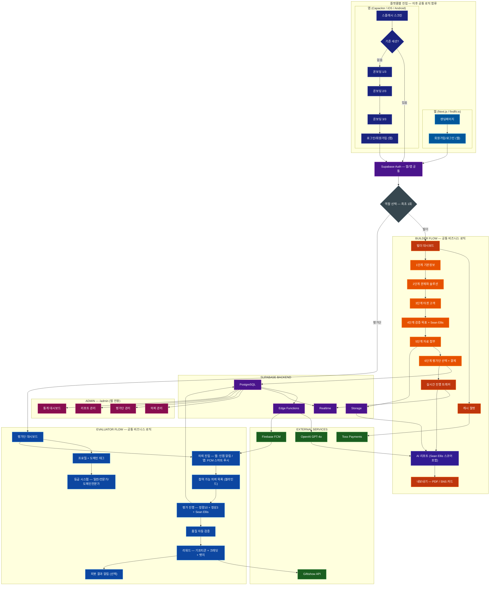

# FindFit — 완전한 서비스 기획서 v3.0
> **Claude Code 자동 로드 파일** | 이 파일은 프로젝트 루트에 위치하며, Claude Code가 세션 시작 시 자동으로 읽습니다.

---

## 문서 구조

| # | 섹션 | 목적 |
|---|------|------|
| 0 | 제품 비전 | 팀이 향할 방향, 투자자 첫인상 |
| 1 | 린 캔버스 | 1페이지 비즈니스 모델 요약 |
| 2 | 캐시 시스템 수익 모델 | 핵심 수익 구조 상세 |
| 3 | Startup Canvas | 전략 + 비즈니스 모델 통합 |
| 4 | Product Strategy Canvas | 9섹션 제품 전략 |
| 5 | VC 프레임워크 & 검증 방법론 | PSST · Sean Ellis · Superhuman · JTBD · ICE |
| 6 | 의뢰 등록 6단계 위자드 UX | VC 방법론 적용 UI 설계 |
| 7 | User Personas | 3개 핵심 페르소나 |
| 8 | Product Discovery | OST · 가정 · 브레인스토밍 · 실험 |
| 9 | Marketing Ideas | 5가지 채널 전략 |
| 10 | 전체 아키텍처 & 기술 스택 | 코드 작성 기준 |
| 11 | 액션 플랜 | 우선순위별 실행 로드맵 |

---

## 서비스 정의

> **FindFit** — 1인 기업 및 소규모 팀이 PSF·PMF를 검증할 수 있는 아이템 리뷰 플랫폼.
> 빌더가 **캐시(크레딧)** 를 소모해 검증 의뢰를 올리면, 관심 카테고리가 일치하는 전문 평가단에게 **스마트 푸시**가 발송되고, 수집된 피드백을 **AI 리포트**로 제공한다.
> *(벤치마크: 숨고 캐시 시스템 + 크라우드컨테스트 역방향 적용)*

---

## 0. 제품 비전 (Product Vision)

*세 가지 비전 후보 — 팀이 가장 공명하는 것을 선택하거나 조합하세요.*

### 비전 A — 인프라 관점 (추천)
> **"검증은 선택이 아닌 표준이 되어야 한다 — 모든 아이디어가 시장의 신호로 시작하는 세상"**

검증 없이 수개월을 투자하고 실패하는 것은 개인의 문제가 아니라 **시스템의 실패**다. FindFit은 PSF·PMF 검증을 누구나 접근할 수 있는 **인프라**로 만든다.

### 비전 B — 빌더 공감 관점
> **"아이디어 단계의 빌더가 '나혼자 확신'이 아닌 '시장의 신호'로 출발할 수 있도록."**

지인은 편향되어 있고, 리서치 에이전시는 너무 비싸다. 단 1만5천 원으로 전문 평가단의 날 선 피드백을 받을 수 있어야 한다.

### 비전 C — 임팩트 관점
> **"검증된 아이디어만 살아남는 게 아니라 — 검증받은 모든 아이디어가 더 강해지는 생태계"**

실패해도 괜찮다. 단, 데이터 기반으로 실패해야 한다. FindFit은 빌더의 피봇을 낭비가 아닌 학습으로 바꾼다.

### 핵심 가치 3원칙

| 가치 | 설명 |
|------|------|
| **저마찰 접근성** | 캐시 시스템으로 1.5만 원부터 검증 시작 가능 |
| **신호 신뢰성** | 지인이 아닌 매칭된 전문 평가단의 구조화된 피드백 |
| **실행 가능 인사이트** | AI 리포트로 "계속/피봇/중단" 판단 근거 제공 |

---

## 1. 린 캔버스 (Lean Canvas)

| 섹션 | 내용 |
|------|------|
| **1. 문제** | ① 지인 피드백은 편향되어 신뢰 불가 ② 전문 리서치는 수백만 원으로 접근 불가 ③ 무엇을 어떻게 검증해야 할지 방법론 부재 |
| **2. 고객 세그먼트** | **얼리 어답터**: PSF 단계 솔로 빌더 (노코드·사이드프로젝트 운영자) — 1~5만 원 예산, 빠른 의사결정 |
| **3. 고유 가치 제안** | **"72시간 안에, 1.5만 원으로, 전문 평가단의 AI 분석 리포트"** — 리서치 에이전시의 1/20 비용, Product Hunt보다 깊은 인사이트 |
| **4. 솔루션** | ① 캐시 기반 셀프서비스 검증 의뢰 ② 카테고리 스마트 매칭 평가단 푸시 ③ GPT-4o AI 리포트 자동 생성 |
| **5. 채널** | 스타트업 커뮤니티 (오픈카톡·슬랙) → SEO 콘텐츠 → 레퍼럴 프로그램 → 액셀러레이터 B2B |
| **6. 수익원** | 캐시 충전 마진 (15~25%) + 심층 AI 리포트 업그레이드 (+5,000C) + 소멸 캐시 귀속 + 기관 선불 패키지 |
| **7. 비용 구조** | 평가단 인센티브 (충전액의 30~40%) + AI API (건당 300~500원) + 플랫폼 개발·유지 (월 50~100만 원) |
| **8. 핵심 지표** | 월간 완료된 검증 세션 수 (NSM) / 첫 캐시 충전 전환율 (Q1 OMTM) |
| **9. 경쟁 우위 (Unfair Advantage)** | 누적 평가단 리뷰 품질 데이터 + 업종별 PSF/PMF 벤치마크 스코어 (복제 불가 데이터 해자) |

---

## 2. 캐시 시스템 수익 모델

### 벤치마크 분석

| 플랫폼 | 캐시 흐름 방향 | 핵심 메커니즘 |
|--------|-------------|-------------|
| **숨고** | 전문가 → 플랫폼 (캐시 소모) | 전문가가 캐시를 써서 고객 요청에 응답 |
| **크라우드컨테스트** | 의뢰자 → 상금 적립 → 당선자 수령 | 의뢰자가 돈을 걸면 다수가 시안 제출, 1인 선택 |
| **FindFit (역방향)** | **빌더 → 플랫폼 (캐시 소모) → 평가단 (인센티브)** | 빌더가 캐시를 써서 평가단 풀에 브로드캐스트 |

### 핵심 캐시 플로우

```
빌더(의뢰자)
    │
    │  1. 캐시 충전 (선불, Toss Payments)
    ▼
[플랫폼 캐시 월렛]
    │
    │  2. 의뢰 등록 시 캐시 소모
    │     (평가단 규모 × 등급별 단가)
    ▼
[스마트 매칭 엔진]
    │
    │  3. 카테고리·관심사 매칭 평가단에게 푸시 발송 (FCM)
    ▼
[평가단 앱/웹 알림]
    │
    │  4. 평가단이 자발적으로 참여 → 구조화된 피드백 제출
    ▼
[AI 리포트 생성 엔진 — GPT-4o via Edge Function]
    │
    │  5. 정량·정성 분석 + PSF/PMF 스코어 + 추천
    ▼
빌더(결과 수령) → PDF 내보내기 / SNS 카드 공유
```

### 캐시 충전 패키지

| 패키지 | 충전액 | 캐시 | 보너스 |
|--------|--------|------|--------|
| 스타터 | 10,000원 | 10,000C | — |
| 라이트 | 30,000원 | 33,000C | +10% |
| 스탠다드 | 70,000원 | 80,000C | +14% |
| 프로 | 150,000원 | 180,000C | +20% |

> 1C = 1원 기준. 보너스 캐시는 대량 충전 유도 장치.

### 의뢰 캐시 소모 구조

| 평가단 등급 | 단가 (캐시/명) | 10명 의뢰 시 |
|------------|-------------|------------|
| 일반 | 1,500C / 명 | 15,000C |
| 전문가 ★★ | 2,500C / 명 | 25,000C |
| 도메인 전문가 ★★★ | 4,000C / 명 | 40,000C |

- 최소 의뢰 단위: **5명** / 최대: **100명**
- 심층 AI 리포트 옵션: **+5,000C** (경쟁사 비교 + 피봇 시나리오 포함)

### 평가단 인센티브

| 등급 | 리뷰당 보상 | 승급 조건 |
|------|-----------|---------|
| 일반 | 500~800원 포인트 | 가입 후 프로필 완성 |
| 전문가 ★★ | 1,200~1,800원 포인트 | 도메인 태그 3개+, 리뷰 10건 이상 |
| 도메인 전문가 ★★★ | 2,000~3,000원 포인트 | 실무 경력 인증 + 품질 점수 상위 20% |

> 포인트 전환: 현금 출금 (5만P 이상) 또는 제휴 기프티콘 (Giftishow API)

### 수익 구조 & 손익분기점

| 수익원 | 마진 | 성장 단계 예상 |
|--------|------|-------------|
| 캐시 충전 마진 | ~15~25% | 핵심 수익원 |
| 소멸 캐시 (180일) | 100% | 변동 수익 |
| 심층 AI 리포트 업그레이드 | ~70% (AI 비용 제외) | 단가 높음 |
| 기관 구독 패키지 (후기) | 협의 | B2B 확장 |

**손익분기점**:
- 월 캐시 충전 200만 원 → 마진 40만 원 (테스트 운영)
- 월 캐시 충전 1,000만 원 → 마진 200만 원 (고정비 커버)
- 월 캐시 충전 3,000만 원 → 마진 600만 원 (흑자 구조)

---

## 3. Startup Canvas

### Part 1: 제품 전략

#### Vision
> **"검증은 선택이 아닌 표준이 되어야 한다 — 모든 아이디어가 시장의 신호로 시작하는 세상"**

#### 시장 세그먼트

**세그먼트 A — 솔로 빌더 (최초 타겟)**
- JTBD: *"출시 전에 '이게 진짜 문제인지' 제3자에게 빠르게 확인하고 싶다. 지인은 편향되어 있어서 믿기 어렵다."*
- 예산 허들: 1~3만 원 / 빠른 결정 / 직접 운영

**세그먼트 B — 초기 스타트업 (2~5인, 투자 전)**
- JTBD: *"PMF 증거를 투자자에게 보여줘야 한다. 데이터가 없으면 설득이 안 된다."*
- 예산 허들: 5~15만 원 / 결과 문서화 중시

**세그먼트 C — 전문 평가단 (공급측)**
- JTBD: *"내 도메인 지식을 활용해서 부업 수입을 얻고 싶다. 흥미로운 신제품도 미리 접하고 싶다."*
- 특성: 실무 경력 + 시간당 20~30분 투자 가능

#### 상대적 비용 전략
- 첫 의뢰 허들 최소화 (1.5만 원~)
- 리서치 에이전시 1/20 비용, UserTesting 1/10 비용
- 가치 경험 후 심층 리포트·전문가 평가단으로 업셀

#### 가치 제안

**빌더 대상**

| 구분 | 내용 |
|------|------|
| **What Before** | 지인 편향 피드백 · 비싼 에이전시 · 노출만 있고 인사이트 없는 Product Hunt |
| **How** | 캐시 충전 → 평가단 규모 선택 → 스마트 푸시 → AI 리포트 수령 (72시간 내) |
| **What After** | "계속/피봇/중단" 신호를 데이터로 확인. 투자자 미팅용 검증 리포트 보유. |
| **vs. Alternatives** | 에이전시 1/20 비용, DIY보다 구조화, Product Hunt보다 깊은 인사이트 |

**평가단 대상**

| 구분 | 내용 |
|------|------|
| **What Before** | 전문성을 활용할 부업 채널 부재 · 신제품 정보는 출시 후에야 접근 가능 |
| **How** | 관심 카테고리 등록 → 매칭 푸시 수신 → 20분 리뷰 → 포인트 수령 |
| **What After** | 소액 부업 수입 + 업계 신제품 선행 접근 + 실제 제품 방향에 영향력 행사 |

#### 트레이드오프 — 우리가 하지 않을 것

- ❌ 월간 구독 모델 (진입 허들 높음, MVP 단계 부적합)
- ❌ 대기업·엔터프라이즈 전용 서비스
- ❌ 1만 명 이상 대규모 설문 (강점 아님)
- ❌ 평가단 경쟁 방식 (1명만 선택 → 신뢰성 저하)
- ❌ SNS 광고 집행 대행, 마케팅 리서치 대행

#### 핵심 지표

| 구분 | 지표 | 목표 |
|------|------|------|
| **North Star** | 월간 완료된 검증 세션 수 | — |
| **Q1 OMTM** | 첫 캐시 충전 전환율 | ≥ 8% |
| **공급 건강** | 활성 평가단 수 (월 1건 이상) | — |
| **운영 품질** | 72시간 내 세션 완료율 | ≥ 80% |

#### 성장 전략 (PLG 기반)

| 단계 | 전략 |
|------|------|
| 0→50 의뢰 | 빌더 커뮤니티 직접 침투 (노코드 코리아, 오픈카톡, 런치패드) |
| 50→500 의뢰 | "검증 실패 방지" 콘텐츠 마케팅 + 첫 충전 보너스 캠페인 |
| 500+ | 액셀러레이터 파트너십 + 레퍼럴 프로그램 |

#### 핵심 역량

| 역량 | 빌드/파트너 | 우선순위 |
|------|-----------|---------|
| 스마트 푸시 매칭 엔진 | 빌드 | 🔴 핵심 |
| AI 리포트 생성 | 빌드 (GPT API) | 🔴 핵심 |
| 평가단 큐레이션 & 등급 | 빌드 | 🔴 핵심 |
| 캐시 충전/결제 | 파트너 (Toss) | 🔴 필수 |
| 이메일·앱 푸시 | 파트너 (FCM/Kakao) | 🟡 중요 |
| 사용자 분석 | 파트너 (PostHog) | 🟡 중요 |

#### Can't / Won't (모방 방어력)

- **Can't**: 전문 평가단 네트워크 + 누적 리뷰 품질 데이터 (즉시 복제 불가)
- **Can't**: 업종별 PSF/PMF 벤치마크 스코어 (데이터 네트워크 효과)
- **Won't**: 대형 SaaS는 1인 기업 저가 시장 진입 무관심
- **Won't**: 기존 리서치 에이전시는 자동화·저가 모델 전환 유인 없음

### Part 2: 비즈니스 모델

#### 비용 구조

| 항목 | 유형 | 초기 규모 |
|------|------|---------|
| 플랫폼 개발 유지 | 고정 | 월 50~100만 원 |
| 평가단 인센티브 | 변동 (매출 연동) | 충전액의 30~40% |
| AI API 비용 (GPT) | 변동 | 건당 약 300~500원 |
| 마케팅·커뮤니티 | 고정+변동 | 월 20~50만 원 |
| 결제 수수료 | 변동 | 매출의 2~3% |

#### 수익 구조

| 수익원 | 초기 | 성장 |
|--------|------|------|
| 캐시 충전 마진 | 월 100~300만 원 | 월 500~2,000만 원 |
| 심층 리포트 업그레이드 | 소액 | 월 100~500만 원 |
| 기관 선불 패키지 | 없음 | 월 200~1,000만 원 |

---

## 4. Product Strategy Canvas (9섹션)

### 1. Vision
> **"검증은 선택이 아닌 표준이 되어야 한다 — 모든 아이디어가 시장의 신호로 시작하는 세상"**

### 2. 시장 세그먼트
- **1순위**: PSF 단계 솔로 빌더 — 출시 전 3~6개월, 예산 제한, 빠른 결정
- **2순위**: PMF 단계 초기 팀 — 투자 유치 전, 데이터 필요, 반복 사용
- **3순위 (후기)**: 액셀러레이터 — 배치 단위 관리, 기관 계약

### 3. 상대적 비용
- 경쟁자 대비 저비용 포지셔닝
- "저렴하지만 신뢰할 수 있다": AI 자동화 + 비동기 평가로 운영비 절감
- 원가 절감: 평가단 자율 참여(수동 모집 불필요) + AI 리포트 자동 생성

### 4. 가치 제안
*(섹션 3 Startup Canvas 참조)*

### 5. 트레이드오프
*(섹션 3 Startup Canvas 참조)*

### 6. 핵심 지표
- **NSM**: 월간 완료된 검증 세션 수
- **OMTM (Q1)**: 첫 캐시 충전 전환율 ≥ 8%
- **건강 지표**: 평가단 완료율 ≥ 80% / 리포트 만족도 NPS ≥ 40

### 7. 성장 전략

| 채널 | 예상 CAC | 확장성 |
|------|---------|--------|
| 스타트업 커뮤니티 (오픈카톡, 슬랙) | 0~5,000원 | 중 |
| SEO ("PMF 검증", "아이템 테스트") | 0원 (시간) | 높음 |
| 레퍼럴 (검증 완료 빌더 추천) | 캐시 보너스 비용 | 높음 |
| 액셀러레이터 파트너십 | 영업 비용 | 높음 (단가) |
| 유료 광고 (Meta/Google) | 1~3만 원 | 높음 (스케일 후) |

### 8. 핵심 역량

**높여야 할 것** (vs 기존 리서치):
- 평가단 전문성·등급 신뢰도
- AI 리포트 인사이트 품질
- 의뢰-완료 속도 (72시간 보장)

**낮춰도 되는 것**:
- 표본 수 (소수 전문가 > 대규모 일반)
- 프로젝트 기간 (수주 → 72시간)
- 가격 (수백만 원 → 수만 원)

**새로운 요소**:
- 캐시 기반 셀프서비스 검증
- 스마트 푸시 매칭 (수동 모집 불필요)
- PSF/PMF 업종별 벤치마크 스코어

### 9. Can't / Won't
*(섹션 3 Startup Canvas 참조)*

**전략 선순환 구조**:
```
캐시 시스템 (낮은 진입 허들)
    → 많은 빌더 유입
    → 평가단 네트워크 성장
    → 더 많은 리뷰 데이터 축적
    → AI 리포트 품질 향상
    → 벤치마크 스코어 신뢰도 상승
    → 빌더 재구매 + 레퍼럴
    → 플랫폼 수익 성장 (데이터 해자 형성)
```

---

## 5. VC 프레임워크 & 검증 방법론

> 이 섹션은 FindFit이 **플랫폼으로서 사용하는 방법론**이자, **VC 투자자에게 제품 가치를 설명하는 언어**다.
> 의뢰 위자드 설계, AI 리포트 구조, 대외 커뮤니케이션 모두 이 프레임워크를 따른다.

---

### 5-1. PSST Law — VC의 4가지 평가 기준

VC가 초기 스타트업을 평가할 때 사용하는 핵심 체크리스트. FindFit의 모든 검증 세션은 이 4가지 관점에서 빌더의 제품을 분석한다.

| 항목 | 의미 | FindFit에서의 적용 |
|------|------|------------------|
| **P — Problem** | 실재하는 문제인가? 충분히 고통스러운가? | 평가단 질문 1~3번: 문제 인식·빈도·강도 측정 |
| **S — Solution** | 문제를 실제로 해결하는가? 기존 대안보다 나은가? | 평가단 질문 4~6번: 솔루션 유용성·차별성 측정 |
| **S — Scale** | 시장 규모가 충분한가? 확장 가능한가? | AI 리포트 섹션: 유사 제품 벤치마크 + 세그먼트 추정 |
| **T — Team** | 이 팀이 이 문제를 해결할 수 있는가? | 빌더 프로필 공개 항목 (선택) — 간접 신뢰 지표 |

> **VC 활용 포인트**: 빌더는 FindFit 리포트의 P·S 스코어를 IR 덱의 "Problem Validation" 슬라이드에 인용 가능.

---

### 5-2. Sean Ellis Test — PMF 측정의 표준

**정의**: 제품이 없어지면 얼마나 실망하겠냐는 단 하나의 질문으로 PMF를 측정하는 방법론.

**질문 (필수 — 모든 FindFit 세션에 포함)**:
> *"이 제품/서비스를 더 이상 사용할 수 없게 된다면 어떤 기분이 들겠습니까?"*
> 1. 매우 실망할 것이다 😢
> 2. 약간 실망할 것이다
> 3. 실망하지 않을 것이다 (대체재가 있다)
> 4. 이 제품을 사용하지 않는다 (해당 없음)

**해석 기준**:

| 결과 | 해석 | FindFit 리포트 표시 |
|------|------|------------------|
| **"매우 실망" ≥ 40%** | **PMF 달성 신호** 🟢 | "강한 시장 수요 확인" |
| "매우 실망" 25~39% | PMF 접근 중 🟡 | "개선 방향 집중 필요" |
| "매우 실망" < 25% | PMF 미달 🔴 | "피봇 또는 재설계 권고" |

**플랫폼 시그니처**: Sean Ellis Test는 FindFit의 **모든 세션에서 필수 항목**이다. 이것이 FindFit을 단순 설문과 차별화하는 핵심 지표다.

> **VC 활용 포인트**: "전문 평가단 20명 대상 Sean Ellis Test 결과: 매우 실망 응답 45%" — IR 덱에 직접 인용 가능한 형식으로 리포트에 포함.

---

### 5-3. Superhuman PMF Engine

Rahul Vohra (Superhuman CEO)가 개발한 PMF 달성 방법론. Sean Ellis Test 이후 **어떻게 PMF를 높일 것인가**의 실행 프레임워크.

**3단계 프로세스**:

```
Step 1: "매우 실망" 세그먼트를 찾아라
    → 누가 가장 강하게 반응하는가? (직업, 사용 방식, 도메인)
    → FindFit: AI 리포트가 평가단 프로필 기반으로 자동 세그먼트 분석

Step 2: 그들이 왜 사랑하는지 파악하라
    → "이 제품의 주된 이점은 무엇입니까?" 정성 응답 분석
    → FindFit: AI 리포트 텍스트 마이닝 → 핵심 키워드 + 감성 클러스터

Step 3: 나머지 사용자를 그 세그먼트처럼 만들어라
    → "사랑하는 세그먼트"의 특징을 제품의 핵심으로 강화
    → FindFit: "이 세그먼트를 주요 타겟으로 전환 시 예상 PMF 점수" 시나리오 제공
```

**FindFit 적용**:
- AI 리포트 섹션 "핵심 팬층 분석"에서 Superhuman Engine 결과 제공
- 빌더는 어떤 평가단이 가장 강하게 반응했는지 도메인별로 확인 가능

---

### 5-4. JTBD (Jobs To Be Done) 프레임워크

**정의**: 사람들이 제품을 "고용"하는 이유 — 그들이 달성하고자 하는 "진짜 일(Job)"에 집중하는 프레임워크.

**핵심 공식**:
> *"[상황]에 처했을 때, 나는 [동기]를 위해 [결과]를 원한다."*
> → When [situation], I want to [motivation], so I can [outcome].

**FindFit에서의 JTBD 적용**:

| 이해관계자 | JTBD |
|-----------|------|
| **솔로 빌더** | 출시 전 불안한 상황에서, 편향 없는 검증을 받기 위해, "출시해도 된다"는 확신을 얻고 싶다 |
| **초기 창업자** | IR 준비 중에, 정량 PMF 증거가 필요해서, 투자자 미팅에서 데이터로 설득하고 싶다 |
| **평가단** | 퇴근 후 저녁 시간에, 전문성을 의미 있게 쓰기 위해, 부수입과 업계 인사이트를 동시에 얻고 싶다 |

**의뢰 위자드 질문 설계 원칙**: 단순 제품 설명이 아닌, 빌더가 JTBD 언어로 문제와 솔루션을 기술하도록 가이드.

---

### 5-5. ICE Score — 가설 우선순위 결정

**정의**: 기능 또는 가설을 실행 우선순위로 정렬하는 3축 점수 시스템.

| 축 | 질문 | 척도 |
|----|------|------|
| **Impact** | 이게 성공하면 NSM에 얼마나 크게 기여하는가? | 1~10 |
| **Confidence** | 성공할 것이라는 근거가 얼마나 강한가? | 1~10 |
| **Ease** | 얼마나 빠르고 쉽게 실행할 수 있는가? | 1~10 |

**ICE Score** = (Impact + Confidence + Ease) / 3

**FindFit MVP 기능 ICE 평가**:

| 기능 | Impact | Confidence | Ease | ICE Score | 우선순위 |
|------|--------|-----------|------|-----------|---------|
| 캐시 월렛 + 결제 | 10 | 9 | 7 | 8.7 | 🔴 1위 |
| 의뢰 등록 6단계 위자드 | 9 | 9 | 7 | 8.3 | 🔴 2위 |
| 스마트 푸시 매칭 | 10 | 8 | 6 | 8.0 | 🔴 3위 |
| AI 리포트 자동 생성 | 10 | 8 | 5 | 7.7 | 🔴 4위 |
| 실시간 진행 트래커 | 7 | 9 | 7 | 7.7 | 🔴 5위 |
| Sean Ellis 필수 질문 | 9 | 10 | 8 | 9.0 | 🔴 All sessions |

---

### 5-6. VC 투자 가능성 체크리스트

> FindFit이 첫 외부 투자를 받기 전 달성해야 할 마일스톤 체크리스트.

| 항목 | 기준 | 현재 상태 |
|------|------|---------|
| **Problem Validation** | 인터뷰 10건 이상, "없어선 안 된다" 응답 | 진행 중 |
| **Sean Ellis PMF** | "매우 실망" ≥ 40% (플랫폼 자체에 대해) | 미측정 |
| **Traction** | 월간 완료 세션 20건 이상, 반복 사용자 존재 | 미달성 |
| **Unit Economics** | 캐시 충전 LTV > CAC × 3 | 검증 필요 |
| **Supply Validation** | 활성 평가단 100명 이상 (10개 이상 도메인) | 미달성 |
| **Team** | 제품 + 비즈니스 + 기술 역할 커버 | 확인 필요 |
| **Market Size** | TAM 수백억 이상 (국내 초기 검증 시장) | 조사 완료 |
| **Defensibility** | 리뷰 데이터 + 평가단 네트워크 = 진입장벽 | 중장기 형성 |

---

## 6. 의뢰 등록 6단계 위자드 UX 설계

> **설계 원칙**: VC 프레임워크(PSST, JTBD)를 빌더가 자연스럽게 따르도록 유도하는 위자드 구조.
> 각 단계는 30자 이내의 짧은 제목으로, 빌더가 "사업계획서 쓰는 느낌" 없이 5분 안에 완료 가능하도록 설계.

---

### Step 1 — 기본 정보 입력

| 항목 | 입력 형식 | 제한 / 가이드 |
|------|---------|------------|
| 아이템 이름 | 단문 텍스트 | 최대 **30자** |
| 한 줄 소개 | 단문 텍스트 | 최대 **60자** ("누구를 위한 어떤 솔루션") |
| 카테고리 | 태그 선택 (복수) | SaaS / 커머스 / 헬스 / 에듀 / 핀테크 / 기타 |
| 검증 단계 | 라디오 | PSF (아직 만들기 전) / PMF (이미 출시, 시장 맞춤 확인) |
| 랜딩 URL | 선택 입력 | 있으면 평가단에게 사전 공유 |

> **30자 제한 설계 의도**: 사업명을 길게 늘어놓지 않도록 강제. 핵심 가치를 압축적으로 표현하는 훈련 효과. 빌더가 "엘리베이터 피치"를 자연스럽게 연습하게 됨.

---

### Step 2 — 문제와 솔루션 (PSST의 P·S)

| 항목 | 입력 형식 | 가이드 텍스트 |
|------|---------|------------|
| 어떤 문제를 해결하나요? | 텍스트 (최대 200자) | "타겟 고객이 지금 어떤 불편을 겪고 있나요? 구체적인 상황을 묘사해주세요." |
| 기존 대안의 한계 | 텍스트 (최대 150자) | "사람들이 지금 이 문제를 어떻게 해결하나요? 그 방법의 단점은?" |
| 우리 솔루션이 다른 점 | 텍스트 (최대 150자) | "우리는 어떻게 다르게 해결하나요? '더 빠르다/싸다/쉽다'보다 구체적으로." |

> **JTBD 가이드**: "문제 = 상황 + 동기 + 원하는 결과" 형식으로 작성을 유도하는 예시 문장 제공.

---

### Step 3 — 타겟 고객 (JTBD 세그먼트)

| 항목 | 입력 형식 | 가이드 |
|------|---------|--------|
| 주요 고객은 누구인가요? | 텍스트 (최대 150자) | "나이, 직업, 상황을 구체적으로. 예: '주 2회 운동하는 30대 직장인'" |
| 이 고객이 이 제품을 언제 찾나요? | 텍스트 | "어떤 순간/상황에서 찾게 되는가 (Trigger)" |
| 이 고객의 구매 결정 기준 | 텍스트 | "가격? 편의성? 신뢰성? 무엇이 결정에 가장 영향을 주나요?" |

---

### Step 4 — 검증 목표 설정 + Sean Ellis Test

> **핵심 단계**: 이 단계에서 Sean Ellis 질문이 **자동으로 의뢰 세션에 포함**된다.

| 항목 | 입력 형식 | 설명 |
|------|---------|------|
| 이번 검증으로 알고 싶은 것 | 텍스트 (최대 200자) | "어떤 의사결정을 위해 검증하시나요? 출시 결정? 투자자 미팅 준비?" |
| 검증 가설 | 텍스트 (최대 200자) | "우리는 [타겟]이 [솔루션] 때문에 [결과]를 원한다고 가정한다." |
| **Sean Ellis Test** | 🔒 자동 포함 | "이 제품이 없어지면 얼마나 실망하겠습니까?" — 모든 세션 필수 포함 |
| 추가 요청 사항 | 텍스트 선택 | 특정 기능에 대한 집중 피드백 요청 등 |

> **Sean Ellis 필수화 이유** (빌더에게 표시되는 안내):
> "Sean Ellis Test는 세계적으로 검증된 PMF 측정 방법론입니다. FindFit은 모든 세션에 이 질문을 포함하여 업종별 벤치마크 데이터를 제공합니다."

---

### Step 5 — 자료 첨부

| 항목 | 형식 | 비고 |
|------|------|------|
| 제품 스크린샷 / 목업 | 이미지 (최대 10장) | Supabase Storage 업로드 |
| 소개 영상 | YouTube / Vimeo URL | 선택 |
| 기타 자료 | PDF (최대 2개) | 선택 |
| 평가단 노출 설정 | 토글 | 의뢰인 정보 공개 범위 설정 |

#### 블라인드 평가 설계 (의뢰인 화면 vs 평가단 화면)

| 항목 | 의뢰인(빌더) 화면 | 평가단 화면 | 블라인드 이유 |
|------|---------------|----------|------------|
| 의뢰인 실명/회사명 | ✅ 본인 정보 확인 | ❌ 숨김 (익명 코드만) | 브랜드/지명도 편향 방지 |
| 빌더의 기대 결과 | ✅ 본인 입력 확인 | ❌ 숨김 | 평가단의 기대 맞추기(sycophancy) 방지 |
| 경쟁사 비교 요청 항목 | ✅ 확인 | ❌ 숨김 | 특정 경쟁사에 대한 선입견 영향 제거 |
| 카테고리 태그 | ✅ 확인 | ✅ 공개 (매칭용) | 도메인 매칭을 위해 필요 |
| 제품 설명 / 자료 | ✅ 확인 | ✅ 공개 | 평가에 필요한 최소 정보 |
| Sean Ellis 질문 | ✅ 의뢰에 포함됨 확인 | ✅ 공개 | 표준 질문은 편향 없음 |

> **블라인드 설계 핵심 원칙**: 평가단이 "의뢰인을 만족시키려는 편향" 없이, 오직 제품 자체에 집중하도록 설계.

---

### Step 6 — 평가단 선택 & 결제

| 항목 | 옵션 |
|------|------|
| 평가단 등급 | 일반 (1,500C/명) / 전문가 (2,500C/명) / 도메인전문가 (4,000C/명) |
| 평가단 수 | 5 / 10 / 20 / 30 / 50 / 100명 (슬라이더) |
| AI 리포트 옵션 | 기본 (포함) / 심층 (+5,000C) |
| 완료 기한 | 72시간 (기본) / 48시간 (+10% 캐시) |
| 최종 캐시 소모 | 자동 계산 표시 |
| 잔여 캐시 | 실시간 표시 |
| 결제 | 캐시 차감 (잔액 부족 시 Toss Payments 팝업) |

---

## 7. User Personas

### 페르소나 1 — "검증이 두려운 솔로 빌더" 김지훈

**기본 정보**
- 나이: 29세 | 직업: 퇴직 후 사이드프로젝트 개발 중 (前 IT 기획자)
- 개발 경험: 노코드 (Bubble, Framer) 활용 가능
- 월 가용 검증 예산: 1~5만 원

**핵심 JTBD**
> *"3개월간 혼자 만든 아이디어가 실제로 시장에서 통할지, 출시 전에 '진짜 낯선 사람'에게 확인받고 싶다."*

**Top 3 페인포인트**
1. 지인 피드백은 편향되어 신뢰 불가 — "그냥 좋다고 해줄 것 같아서"
2. 전문 리서치는 너무 비싸고 복잡하다 — 견적만 받아봐도 수백만 원
3. PSF를 어떻게 검증해야 할지 방법론 자체를 모른다

**Top 3 원하는 것**
1. 30분 안에 의뢰를 완료할 수 있는 간단한 프로세스
2. "계속 진행해도 된다/피봇해야 한다" 명확한 판단 근거
3. 추가 비용 없이 리포트까지 한 번에 해결

**예상치 못한 인사이트**
> *지훈은 리포트 내용보다 "전문가들이 내 아이디어를 진지하게 봐줬다"는 사실 자체에서 심리적 확신을 얻는다. 결과가 나쁘더라도 "검증받았다"는 과정이 출시 결정에 힘이 된다.*

**제품 시사점**: "N명의 전문가가 검토했습니다" 신뢰 시그널을 리포트 상단에 전면 배치. 평가단 프로필 (익명화된 경력) 미리보기 제공.

---

### 페르소나 2 — "투자자 설득이 급한 초기 창업자" 박소연

**기본 정보**
- 나이: 34세 | 직업: B2B SaaS 스타트업 공동창업자 (3인 팀)
- 6개월 내 시드 라운드 목표
- 월 가용 검증 예산: 10~30만 원

**핵심 JTBD**
> *"투자자에게 'PMF 진행 중' 증거를 보여줘야 한다. 인터뷰 5건만으로는 부족하고, 정량 데이터가 필요하다."*

**Top 3 페인포인트**
1. 사용자 인터뷰는 시간이 너무 많이 걸리고 정량화가 어렵다
2. 투자자들은 "지인 인터뷰" 데이터를 신뢰하지 않는다
3. PSF인지 PMF인지 어떤 단계를 검증해야 하는지 모른다

**Top 3 원하는 것**
1. IR 자료에 인용 가능한 정량 수치 ("전문 평가단 20명 중 Sean Ellis 매우 실망 55%")
2. 업종 평균 대비 상대적 위치 (벤치마크 스코어)
3. 팀 전체가 공유할 수 있는 다운로드 가능 리포트

**예상치 못한 인사이트**
> *소연은 검증 결과가 부정적이어도 괜찮다고 생각한다. "우리가 무엇을 발견했고 어떻게 피봇했는지"를 투자자에게 보여주는 것 자체가 실행력의 증거다.*

**제품 시사점**: "피봇 추천 리포트"가 긍정 결과 못지않게 가치 있음. "검증 히스토리 타임라인" 기능으로 성장 궤적 보여주기.

---

### 페르소나 3 — "의미 있는 부업을 원하는 도메인 전문가" 이민준

**기본 정보**
- 나이: 38세 | 직업: B2B SaaS 회사 PM (7년 경력)
- 관심 도메인: SaaS · 프로덕티비티 · HR테크
- 가능한 시간: 주 2~4시간 (퇴근 후 저녁)

**핵심 JTBD**
> *"내 PM 경험을 활용해서 부수입을 얻고 싶다. 동시에 시장에 나오는 신제품들을 남들보다 먼저 알고 트렌드를 파악하고 싶다."*

**Top 3 페인포인트**
1. 기존 설문 플랫폼은 내 전문성과 무관한 질문들로 시간 낭비
2. 부업으로 프리랜서 컨설팅을 하고 싶지만 첫 클라이언트 찾기 어려움
3. 내가 리뷰한 내용이 실제로 반영됐는지 알 방법이 없다

**Top 3 원하는 것**
1. 내 도메인에 맞는 의미 있는 질문 — 전문성을 발휘할 수 있는 리뷰
2. 소액이더라도 안정적인 인센티브 + 실력 인정 등급 시스템
3. 내가 기여한 빌더의 제품이 어떻게 됐는지 피드백

**예상치 못한 인사이트**
> *민준은 돈보다 "영향력"을 더 중시한다. 자신의 리뷰가 빌더의 피봇 결정에 기여했다는 사실이 더 강한 동기가 된다.*

**제품 시사점**: "당신의 피드백으로 이 빌더가 피봇했습니다" 알림 기능. 평가단 기여 배지 시스템.

---

## 8. Product Discovery

### 핵심 목표 (Desired Outcome)
> **"빌더가 캐시를 충전하고 평가를 의뢰해서, 72시간 내 AI 리포트로 PSF/PMF 여부를 데이터 기반으로 판단한다."**

---

### 기회-솔루션 트리 (Opportunity Solution Tree)

```
[목표] 빌더가 출시 전 데이터 기반 검증을 완료한다

├── [기회 1] 빌더가 검증 비용이 부담스러워 망설인다
│   ├── 솔루션: 캐시 시스템으로 1.5만 원부터 시작 가능
│   ├── 솔루션: 첫 충전 보너스 캐시 제공 (50% 추가)
│   └── 실험: "1.5만 원에 PSF 검증" LP 전환율 측정
│
├── [기회 2] 평가단을 찾고 연결하는 과정이 어렵다
│   ├── 솔루션: 카테고리 태그 기반 스마트 푸시 자동 발송
│   ├── 솔루션: 평가단 등급 시스템으로 품질 보장
│   └── 실험: 초기 수동 모집 30명 → 도메인 커버리지 확인
│
├── [기회 3] 피드백 수집 후 해석·활용이 어렵다
│   ├── 솔루션: AI 리포트 자동 생성 (Sean Ellis 스코어 + 인사이트)
│   ├── 솔루션: "계속/피봇/중단" 추천을 리포트 상단 표시
│   └── 실험: 수작업 리포트 3건 제작 후 빌더 만족도 측정
│
├── [기회 4] 무엇을 검증해야 할지 모른다
│   ├── 솔루션: 6단계 위자드 (PSST + JTBD 프레임워크 내재화)
│   ├── 솔루션: PSF vs PMF 선택 도우미 + 업종별 표준 템플릿
│   └── 실험: 가이드 유무별 의뢰 완료율 A/B 테스트
│
└── [기회 5] 평가단 참여율이 낮아 세션이 완료되지 않는다
    ├── 솔루션: 스마트 푸시 타이밍 최적화 (저녁 7~10시)
    ├── 솔루션: 평가단 연속 참여 보너스 (스트릭 시스템)
    └── 실험: 푸시 발송 시간대별 완료율 비교
```

---

### 핵심 가정 우선순위 (Impact × Risk)

| 순위 | 가정 | 검증 방법 | 기간 |
|------|------|---------|------|
| 🔴 1위 | 빌더들이 1.5~5만 원 캐시를 기꺼이 충전한다 | LP + "충전" CTA 전환율 | 2주 |
| 🔴 2위 | 매칭 푸시 평가단이 72시간 내 리뷰를 완료한다 (목표 80%) | 수동 운영 10건 | 4주 |
| 🟡 3위 | AI 리포트가 빌더 의사결정에 실질적 도움이 된다 | 컨시어지 MVP 후 인터뷰 | 4주 |
| 🟡 4위 | 전문가 평가단이 일반보다 유의미하게 높은 피드백을 제공한다 | A/B 비교 | 6주 |
| 🟢 5위 | 소멸 캐시 비율이 수익성에 기여한다 | 6개월 후 캐시 데이터 | 6개월 |

---

### 기능 브레인스토밍 (Multi-Perspective)

#### PM 관점 — 시장 적합성 & 경쟁 우위

| # | 기능 | 핵심 가정 | 우선순위 |
|---|------|---------|---------|
| 1 | **PSF/PMF Signal Score** — 업종 평균 대비 상대 점수 | 벤치마크 데이터 축적 가능 | 🟡 중기 |
| 2 | **검증 A/B 모드** — 두 버전 동시 평가 | 빌더가 두 버전 이상 보유 | 🟡 중기 |
| 3 | **의뢰 히스토리 타임라인** — 검증→피봇→재검증 스토리 시각화 | 투자자 narrative 수요 | 🟡 중기 |
| 4 | **기관 대시보드** — 액셀러레이터 배치 관리 | B2B 수요 검증 필요 | 🟢 후기 |
| 5 | **검증 완료 뱃지** — "전문 평가단 N명 검증" 공식 인증 마크 | 빌더 마케팅 활용 의향 | 🟡 중기 |

#### 디자이너 관점 — UX & 참여 경험

| # | 기능 | 핵심 가정 | 우선순위 |
|---|------|---------|---------|
| 1 | **의뢰 등록 6단계 위자드** — 3단계 가이드 후 질문 세트 자동 추천 | 방법론 몰라도 쉽게 시작 | 🔴 MVP |
| 2 | **실시간 진행 트래커** — "현재 N명이 리뷰 중" 상태 바 | 가시화가 이탈 감소 | 🔴 MVP |
| 3 | **워드클라우드 + 감성 분석 시각화** — 리포트 핵심 키워드 | AI 분석 품질 전제 | 🟡 중기 |
| 4 | **평가단 모바일 리뷰 카드** — 스와이프 기반 인터페이스 | 평가단 모바일 비율 높음 | 🟡 중기 |
| 5 | **공유 가능 리포트 카드** — SNS 공유 1장 이미지 | 빌더 소셜 공유 의향 | 🟡 중기 |

#### 엔지니어 관점 — 기술 혁신 & 플랫폼 역량

| # | 기능 | 핵심 가정 | 우선순위 |
|---|------|---------|---------|
| 1 | **AI 리포트 파이프라인** — 응답 → GPT-4o → 구조화 인사이트 | GPT 비용 건당 500원 이내 | 🔴 MVP |
| 2 | **스마트 푸시 매칭 엔진** — 태그×카테고리×시간대 알고리즘 | 매칭 정확도 = 완료율 | 🔴 MVP |
| 3 | **캐시 월렛 & 충전 시스템** — Toss Payments 연동 | 결제 UX가 충전 전환에 영향 | 🔴 MVP |
| 4 | **응답 품질 자동 스크리닝** — 저품질 자동 필터 (3분 미만, 20자 미만) | 저품질이 AI 리포트 오염 | 🟡 중기 |
| 5 | **Webhook / API 연동** — Notion, Slack 자동 전송 | 스타트업 툴 연동 수요 | 🟢 후기 |

---

### TOP 5 MVP 기능

| 순위 | 기능 | 이유 |
|------|------|------|
| 1 | 캐시 월렛 + 결제 시스템 | 수익 모델 핵심 인프라 |
| 2 | 의뢰 등록 6단계 위자드 | 빌더 온보딩 마찰 최소화 |
| 3 | 스마트 푸시 매칭 엔진 | 공급(참여)과 품질 동시 확보 |
| 4 | AI 리포트 자동 생성 (Sean Ellis 포함) | 차별화 핵심 + 운영 비용 절감 |
| 5 | 실시간 진행 트래커 | 빌더 이탈 방지 + 신뢰 형성 |

---

### 검증 실험 로드맵

| 주차 | 실험 | 성공 기준 |
|------|------|---------|
| Week 1~2 | "1.5만 원 PSF 검증" LP 배포 + 커뮤니티 공유 | 방문 → 충전 클릭률 ≥ 5% |
| Week 1~2 | 평가단 1차 모집 (LinkedIn + 오픈카톡) | 50명 이상, 10개 이상 도메인 |
| Week 3~6 | 컨시어지 MVP 5건 수동 진행 | 5건 중 4건 72시간 내 완료 |
| Week 5~6 | 컨시어지 완료 후 빌더 인터뷰 | 5명 중 4명 "다음에 또 쓰겠다" |
| Week 7~10 | 노코드 MVP 플랫폼 출시 | 자연 유입 첫 10건 자력 완료 |

---

## 9. Marketing Ideas

### 마케팅 컨텍스트
- 타겟: 솔로 빌더 + 초기 스타트업 창업자
- 예산: 초기 월 20~50만 원
- 핵심 차별점: 캐시 시스템 저진입 + 전문 평가단 + AI 리포트 + Sean Ellis 표준 측정

---

### Idea 1 — "검증 없이 실패한 빌더들의 이야기" 콘텐츠 시리즈

**채널**: 브런치 + LinkedIn + 커뮤니티 뉴스레터

**핵심 메시지**:
> *"3개월간 만든 앱이 0명이 쓴 이유 — 출시 전 단 1시간의 검증이면 알 수 있었던 것들"*

**왜 효과적인가**: 실패 스토리는 공감과 공유율이 높음. "나도 저랬을 수 있었다"는 반응이 플랫폼 필요성을 자연 설득. SEO 콘텐츠로도 활용 ("PMF 실패 사례", "린스타트업 검증 방법").

**비용 효율**: 제작비 0원 (창업자 직접 작성 or 컨시어지 MVP 빌더 인터뷰 기반)

---

### Idea 2 — "첫 충전 보너스" 론칭 캠페인

**채널**: 스타트업 커뮤니티 (오픈카톡, 슬랙, 런치패드, 스타트업 얼라이언스)

**핵심 메시지**:
> *"론칭 기념: 첫 캐시 충전 시 50% 보너스 — 1만 원 충전하면 1.5만 원으로 시작하세요"*

**왜 효과적인가**: 첫 충전 허들이 최대 전환 장벽 → 보너스로 심리적 손실 감소. 충전 후 실제 의뢰까지 전환율 측정 가능.

**비용 효율**: 보너스 캐시는 실제 사용 시에만 비용 발생. 광고비 없이 유기 배포로 시작.

---

### Idea 3 — "평가단 앰배서더" 도메인 전문가 입소문 프로그램

**채널**: LinkedIn + 도메인별 커뮤니티 (PM 커뮤니티, SaaS 오픈카톡)

**핵심 메시지**:
> *"당신의 10년 PM 경험, 주 2시간으로 부업 + 업계 신제품 선행 접근 — 전문 평가단 모집 중"*

**왜 효과적인가**: 평가단 확보는 공급측 병목 — 선제적 네트워크 필수. 앰배서더 평가단이 주변 빌더들에게 플랫폼 소개하는 이중 효과.

**비용 효율**: 앰배서더 혜택: 보너스 포인트 or 우선 매칭권. 현금 없이 네트워크 효과로 확산.

---

### Idea 4 — "검증 결과 카드" 소셜 공유 + UGC 캠페인

**채널**: Instagram / LinkedIn / X (빌더 계정)

**핵심 메시지**:
> *"전문 평가단 15명이 내 아이디어를 검증했습니다 — Sean Ellis PMF 점수 55%, '강한 구매 의향' 응답 73%"*

**왜 효과적인가**: 빌더 자발 공유 → 플랫폼 인지도 자연 확산 (제로 광고비). "나도 저렇게 검증받고 싶다"는 모방 심리 유발. 공유 카드에 플랫폼 URL 자동 삽입.

**비용 효율**: 개발 1회 → 이후 무한 반복 UGC 효과.

---

### Idea 5 — 액셀러레이터 / 창업 교육 기관 파트너십 번들

**채널**: B2B 직접 영업 + 콘퍼런스 (TIPS, 스파크랩, 퓨처플레이)

**핵심 메시지**:
> *"배치 내 모든 팀의 PSF/PMF를 표준화된 방법으로 검증하세요 — 기관 전용 대시보드 + 캐시 패키지"*

**왜 효과적인가**: 1건 계약으로 10~20개 팀 확보 (높은 단위 경제성). 검증 결과를 투자자에게 제출하는 표준 프로세스로 포지셔닝.

**비용 효율**: LTV 매우 높음. 기관 케이스 스터디가 다음 영업 레퍼런스.

---

## 10. 전체 아키텍처 & 기술 스택

> 이 섹션은 Claude Code가 코드를 작성할 때 반드시 참조해야 하는 기술 기준이다.

### 기술 스택

| 영역 | 기술 | 비고 |
|------|------|------|
| 웹 프론트엔드 | Next.js 14 (App Router) | Vercel 배포, `findfit.io` |
| 앱 변환 | Capacitor.js | 웹 코드 재사용, iOS/Android 빌드 |
| 백엔드 | Supabase | Auth + PostgreSQL + Storage + Realtime |
| AI 리포트 | OpenAI GPT-4o API | Edge Function에서만 트리거 |
| 결제 | Toss Payments | 캐시 패키지 충전 |
| 푸시 알림 | Firebase FCM | 평가단 스마트 매칭 푸시 (앱 전용) |
| 리워드 | Giftishow API | 카카오톡 기프티콘 자동 발송 |
| 스타일 | Tailwind CSS | Glassmorphism UI, 메인 컬러 #FF8C00 |

### 전체 서비스 아키텍처 (Mermaid)



### 디렉토리 구조

```
findfit/
├── app/                          # Next.js App Router
│   ├── (landing)/
│   │   └── page.tsx              # 랜딩페이지
│   ├── auth/
│   │   ├── signup/page.tsx
│   │   ├── login/page.tsx
│   │   └── role-select/page.tsx
│   ├── builder/
│   │   ├── dashboard/page.tsx
│   │   ├── wallet/page.tsx
│   │   ├── new-request/
│   │   │   ├── page.tsx          # 6단계 위자드 컨테이너
│   │   │   └── steps/            # step1~step6 컴포넌트
│   │   ├── requests/
│   │   │   └── [id]/page.tsx     # 의뢰 상세 + 실시간 트래커
│   │   └── reports/
│   │       └── [id]/page.tsx     # AI 리포트 뷰어
│   ├── evaluator/
│   │   ├── dashboard/page.tsx
│   │   ├── available/page.tsx    # 참여 가능 의뢰 목록
│   │   ├── review/
│   │   │   └── [id]/page.tsx     # 평가 진행 (블라인드)
│   │   ├── history/page.tsx
│   │   └── profile/page.tsx
│   └── admin/
│       ├── requests/page.tsx
│       ├── evaluators/page.tsx
│       ├── reports/page.tsx
│       └── stats/page.tsx
├── components/
│   ├── ui/                       # 공통 UI (Button, Card, Modal 등)
│   ├── builder/                  # 빌더 전용 컴포넌트
│   ├── evaluator/                # 평가단 전용 컴포넌트
│   └── shared/                   # 공통 비즈니스 컴포넌트
├── lib/
│   ├── supabase/
│   │   ├── client.ts
│   │   ├── server.ts
│   │   └── middleware.ts
│   ├── openai/
│   │   └── report.ts             # AI 리포트 생성 로직
│   └── utils/
├── supabase/
│   ├── migrations/
│   └── functions/
│       ├── generate-report/      # AI 리포트 트리거 (Sean Ellis 포함)
│       ├── send-push/            # FCM 푸시 발송
│       └── release-reward/       # 리워드 자동 지급
├── capacitor.config.ts
└── claude_findfit.md             # 이 파일 (Claude Code 자동 로드)
```

### Supabase 데이터베이스 스키마

```sql
-- 사용자
users (id, email, role: 'builder'|'evaluator'|'admin', created_at)

-- 빌더 프로필
builder_profiles (id, user_id, company_name, cash_balance, total_requests)

-- 평가단 프로필
evaluator_profiles (id, user_id, grade: 'general'|'expert'|'domain',
                    domains[], review_count, quality_score, credit_balance)

-- 의뢰
requests (id, builder_id, title, description, stage: 'psf'|'pmf',
          category, target_count, evaluator_grade, status: 'pending'|'active'|'completed',
          cash_spent, created_at)

-- 평가 (블라인드: evaluator는 builder_id 접근 불가)
evaluations (id, request_id, evaluator_id, answers JSONB,
             sean_ellis_score: 1-4,  -- 1=매우실망 2=약간실망 3=실망안함 4=해당없음
             quality_score, submitted_at)

-- AI 리포트
reports (id, request_id, psf_score: 0-100, pmf_score: 0-100,
         sean_ellis_40_passed: boolean,  -- "매우실망" >= 40% 여부
         summary, recommendation: 'continue'|'pivot'|'stop',
         insights JSONB, superhuman_segment JSONB, created_at)

-- 캐시 거래 내역
cash_transactions (id, user_id, type: 'charge'|'spend'|'expire', amount, created_at)

-- 알림
notifications (id, user_id, type, message, is_read, created_at)
```

### 핵심 비즈니스 규칙

**캐시 시스템**
- 1C = 1원 기준
- 충전 패키지: 스타터 10,000C / 라이트 33,000C / 스탠다드 80,000C / 프로 180,000C
- 의뢰 단가: 일반 1,500C/명 · 전문가 2,500C/명 · 도메인전문가 4,000C/명
- 심층 AI 리포트: +5,000C
- 미사용 캐시 180일 후 자동 소멸

**Sean Ellis 기준 (AI 리포트 필수 항목)**
- "없어지면 매우 실망" 응답 ≥ 40% → PSF/PMF 달성 신호 🟢
- 25~39% → 개선 집중 필요 🟡
- < 25% → 피봇 또는 재설계 권고 🔴

**AI 리포트 생성 조건**
- 모든 평가 완료 → Supabase Edge Function 자동 트리거 → GPT-4o 호출
- 결과: Sean Ellis 스코어 + PSF/PMF 점수(0-100) + 인사이트 TOP5 + 계속/피봇/중단 추천 + Superhuman 세그먼트 분석

**품질 필터 조건 (자동 반려)**
- 주관식 응답 20자 미만
- 전체 응답 소요 시간 3분 미만
- 모든 리커트 동일 점수 선택

**블라인드 평가 규칙**
- 평가단은 `builder_id`, `company_name`, 의뢰인 기대 결과에 접근 불가
- Row Level Security (RLS) 정책으로 DB 레벨에서 강제

### UI/UX 가이드라인

| 항목 | 값 |
|------|------|
| **디자인 컨셉** | Glassmorphism (Glass Surface) |
| **메인 컬러** | `#FF8C00` (오렌지) |
| **빌더 계열** | `#E65100` ~ `#FF6D00` (오렌지) |
| **평가단 계열** | `#0D47A1` ~ `#42A5F5` (블루) |
| **배경** | 다크 그라디언트 `#1a0a00` → `#1a1a2e` |
| **Glass 카드** | `background: rgba(255,255,255,0.07)` + `backdrop-filter: blur(12px)` |
| **Sean Ellis 결과 색상** | ≥40% → `#4CAF50` / 25~39% → `#FF9800` / <25% → `#F44336` |

### 코드 작성 규칙 (Claude Code 필독)

1. **TypeScript 필수** — 모든 컴포넌트와 함수에 타입 명시
2. **Supabase 클라이언트** — 서버 컴포넌트는 `lib/supabase/server.ts`, 클라이언트는 `lib/supabase/client.ts`
3. **역할 기반 접근 제어** — 미들웨어에서 `role` 체크 후 `/builder`, `/evaluator`, `/admin` 라우팅
4. **캐시 잔액 검증** — 의뢰 등록 시 **서버 사이드**에서 잔액 확인 후 차감 (클라이언트 신뢰 금지)
5. **AI 리포트** — Edge Function에서만 OpenAI 호출 (API 키 노출 방지)
6. **실시간 트래커** — Supabase Realtime 구독으로 구현, **폴링 사용 금지**
7. **푸시 알림** — FCM은 앱 전용, 웹은 Supabase Realtime 알림
8. **블라인드 평가** — `evaluations` 조회 시 builder 정보 JOIN 금지 (RLS 정책 준수)
9. **Sean Ellis 스코어** — `sean_ellis_score: 1` 응답 비율을 리포트의 최상단 지표로 표시

### 환경 변수 (.env.local)

```bash
NEXT_PUBLIC_SUPABASE_URL=
NEXT_PUBLIC_SUPABASE_ANON_KEY=
SUPABASE_SERVICE_ROLE_KEY=

OPENAI_API_KEY=

NEXT_PUBLIC_TOSS_CLIENT_KEY=
TOSS_SECRET_KEY=

FIREBASE_SERVER_KEY=
NEXT_PUBLIC_FIREBASE_CONFIG=

GIFTISHOW_API_KEY=
```

### FigJam 다이어그램 링크

- **통합 아키텍처 (웹+앱 최종본)**: https://www.figma.com/board/7WKsoeJB1hRb5yKWXg8rFx
- **웹 전용 v2**: https://www.figma.com/board/77GFPkqtVYSN9AqAqe1EBp
- **앱 전용 v2**: https://www.figma.com/board/x8iaJ14VGvxKBWYLQUzmkh

---

## 11. 액션 플랜

### 즉시 실행 (Week 1~2)

| 액션 | 담당 | 완료 기준 |
|------|------|---------|
| LP 제작 + 캐시 충전 CTA 전환율 실험 | 창업자 | 방문 → 클릭 ≥ 5% |
| 평가단 1차 모집 (LinkedIn + 오픈카톡) | 창업자 | 50명+ 지원, 10개+ 도메인 |
| "검증 실패 스토리" 콘텐츠 초안 작성 | 창업자 | 브런치/LinkedIn 1편 발행 |

### 단기 (Week 3~6)

| 액션 | 담당 | 완료 기준 |
|------|------|---------|
| 컨시어지 MVP 5건 수동 진행 | 창업자 | 5건 중 4건 72시간 내 완료 |
| 컨시어지 완료 후 빌더 인터뷰 | 창업자 | "다음에 또 쓰겠다" 4/5명 |
| 캐시 월렛 + 6단계 위자드 노코드 프로토타입 | 개발 | Toss 결제 연동 완료 |
| AI 리포트 생성 파이프라인 프로토타입 | 개발 | Sean Ellis 포함 첫 리포트 생성 |

### 중기 (Week 7~12)

| 액션 | 담당 | 완료 기준 |
|------|------|---------|
| 스마트 푸시 매칭 엔진 구현 | 개발 | 평가단 완료율 ≥ 70% |
| 검증 결과 SNS 공유 카드 기능 | 개발 | 첫 UGC 공유 확인 |
| 액셀러레이터 파트너십 첫 미팅 | 창업자 | TIPS/스파크랩 중 1개 이상 |
| VC 투자 체크리스트 달성 목표 설정 | 창업자 | Sean Ellis 40%+ 데이터 확보 |

---

## 전략 일관성 최종 점검

```
캐시 시스템 (낮은 진입 허들: 1.5만 원~)
    ↓
많은 빌더 유입 → 6단계 위자드로 PSST/JTBD 자연 학습
    ↓
스마트 푸시로 매칭된 평가단 참여 (블라인드 보장)
    ↓
AI 리포트 + Sean Ellis 스코어로 빌더 만족도 상승
    ↓
재충전 + 레퍼럴 확산 + SNS 공유 카드 바이럴
    ↓
더 많은 리뷰 데이터 축적 → 업종별 벤치마크 스코어 신뢰도 상승
    ↓
플랫폼 가치 상승 → 데이터 해자 → 경쟁사 모방 어려워짐
    ↓
VC 투자 유치 가능 → 규모 확장
```

**핵심 리스크**: 초기 공급-수요 닭-달걀 문제 — 빌더는 평가단이 없으면 충전 안 하고, 평가단은 의뢰가 없으면 떠남.
**해결책**: 컨시어지 MVP로 수동 진행하며 양측 동시 확보.

---

*FindFit 서비스 기획서 v3.0 — 최종 업데이트: 2026-04-28*
*작성 도구: Anthropic Claude (Cowork Mode) | PM 플러그인: pm-product-strategy, pm-market-research, pm-execution, pm-product-discovery, pm-marketing-growth*
