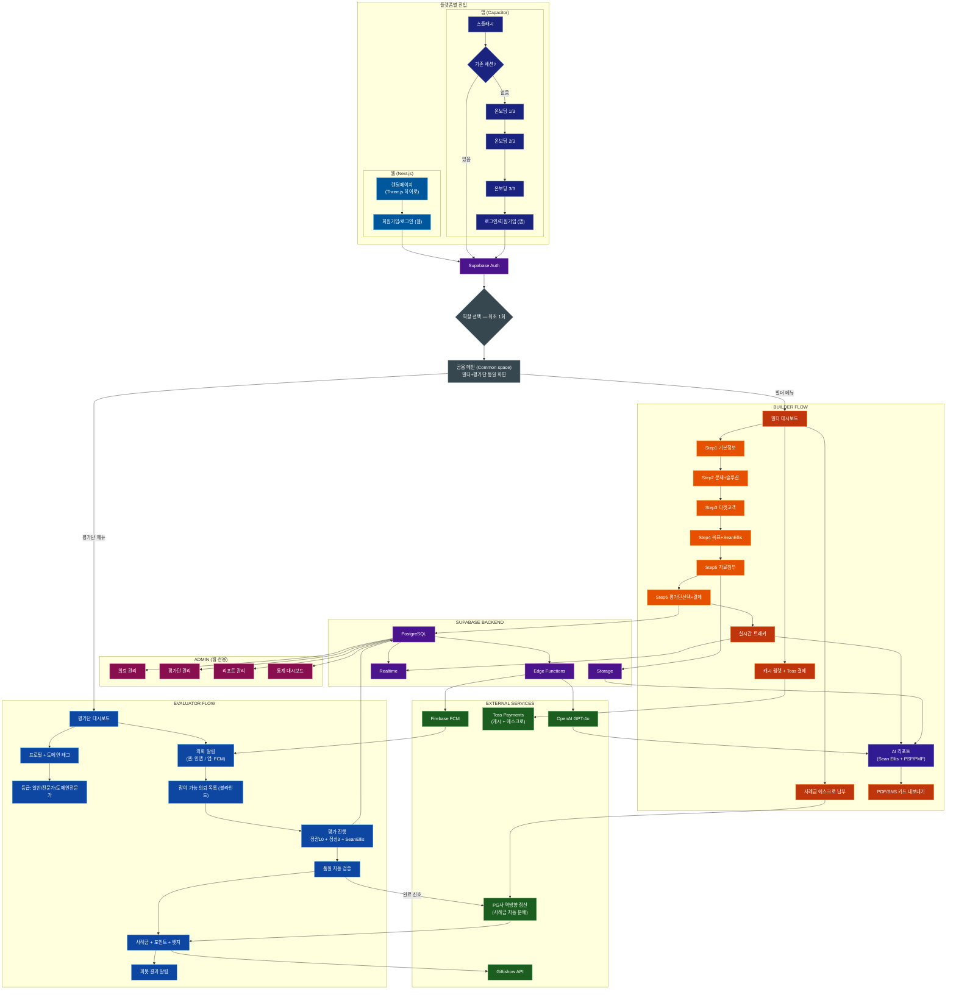

# FindFit — 완전한 서비스 기획서 & Claude Code 컨텍스트 v4.0

> **Claude Code 자동 로드 파일** — 이 파일을 읽었으면 코드 작성 전 반드시 전체 내용을 숙지하세요.
> 아키텍처, 네이밍 규칙, 비즈니스 로직, 랜딩페이지 디자인 스펙을 모두 따르세요.

---

## 문서 구조

| # | 섹션 | 목적 |
|---|------|------|
| 0 | 서비스 정의 & 비전 | 방향성 |
| 1 | 수익 구조 (전체 상세) | 개발 과금 로직 기준 |
| 2 | 랜딩페이지 디자인 스펙 | Three.js 히어로 포함 UI 기준 |
| 3 | Startup Canvas & 제품 전략 | 사업 맥락 |
| 4 | VC 프레임워크 & 검증 방법론 | 플랫폼 핵심 철학 |
| 5 | 의뢰 등록 6단계 위자드 UX | 빌더 플로우 설계 |
| 6 | User Personas | 타겟 설계 기준 |
| 7 | Product Discovery | 기능 우선순위 |
| 8 | 전체 아키텍처 & 기술 스택 | 코드 작성 기준 |
| 9 | 액션 플랜 | 실행 로드맵 |

---

## 0. 서비스 정의 & 비전

**FindFit** — 1인 기업 및 소규모 팀이 아이디어를 출시 전에 실제 사람들에게 검증받는 양면 마켓플레이스.

- **빌더(의뢰자)**: 캐시를 소모해 검증 의뢰 등록 → 전문 평가단 스마트 매칭 → AI 리포트 수신
- **평가단(리뷰어)**: 관심 카테고리 매칭 푸시 수신 → 구조화된 리뷰 → 사례금 + 포인트 수령
- **수익 모델**: 캐시 충전 마진 + **사례금 중간 수수료 (핵심)** + 부가 옵션

> **비전**: "만들기 전에, 팔릴지 먼저 확인하세요 — 모든 아이디어가 시장의 신호로 시작하는 세상"

---

## 1. 수익 구조 (전체 상세)

### 수익원 구조 개요

FindFit의 수익은 **3개 축**으로 구성된다:
1. **캐시 충전 마진** — 선불 현금흐름
2. **사례금 중간 수수료** — 거래 수수료 (핵심 수익원)
3. **부가 옵션** — 업셀 수익

---

### 수익원 1 — 캐시 충전 마진 (빌더 대상)

빌더가 의뢰 등록을 위해 캐시를 충전할 때 발생하는 마진.

| 패키지 | 충전액 | 지급 캐시 | 실질 단가 | 플랫폼 마진 |
|--------|--------|---------|---------|-----------|
| 스타터 | 10,000원 | 10,000C | 1.000원/C | 없음 (획득 유도) |
| 라이트 | 30,000원 | 33,000C | 0.909원/C | 충전-사용 차액 |
| 스탠다드 | 70,000원 | 80,000C | 0.875원/C | 충전-사용 차액 |
| 프로 | 150,000원 | 180,000C | 0.833원/C | 충전-사용 차액 |

**추가 수익**: 180일 미사용 캐시 소멸 → 플랫폼 귀속

**의뢰 캐시 소모 단가**:

| 평가단 등급 | 단가 | 10명 의뢰 소모 | 스탠다드 기준 실질 원가 |
|-----------|------|------------|-------------------|
| 일반 | 1,500C/명 | 15,000C | 13,125원 |
| 전문가 ★★ | 2,500C/명 | 25,000C | 21,875원 |
| 도메인전문가 ★★★ | 4,000C/명 | 40,000C | 35,000원 |

---

### 수익원 2 — 사례금 중간 수수료 ⭐ 핵심 수익원

의뢰자가 평가단에게 지급하는 **사례금**에서 FindFit이 15% 수수료를 가져가는 구조.
수수료는 의뢰자 7.5% / 평가단 7.5%로 양측이 분담.

#### 돈의 흐름 (에스크로 구조)

```
[의뢰자]
사례금 납부 → Toss Payments / PG사 보관
                    │
                    ▼
              [FindFit]
         완료 확인 신호만 전달
         수수료 수취 (15%)
                    │
                    ▼
              [PG사 정산]
         수수료 차감 후 자동 분배
                    │
                    ▼
              [평가단]
         사례금 수령 (신원 익명 유지)
         기프티콘 or 계좌 정산
```

#### 합법성 근거

- FindFit이 자금을 **직접 보관하지 않음** → 결제대금예치업 등록 불필요
- PG사가 보관 및 분배 처리
- 포인트 현금 출금 없음 → 선불전자지급수단 발행업 해당 없음
- 블라인드 구조: 의뢰자-평가단 신원 미공개, PG사 정산도 익명 처리

#### 건당 수익 상세 계산 (10명 의뢰 / 사례금 50,000원/명 기준)

**A. 캐시 수익**

| 항목 | 금액 |
|------|------|
| 의뢰자 캐시 소모 (10명 × 1,500C) | 15,000C |
| 실제 받은 돈 (스탠다드 기준 0.875원/C) | 13,125원 |
| OpenAI API 비용 차감 | -500원 |
| **캐시 순수익** | **12,625원** |

**B. 사례금 수수료 수익**

| 항목 | 금액 |
|------|------|
| 총 사례금 (10명 × 50,000원) | 500,000원 |
| 의뢰자 수수료 7.5% | +37,500원 |
| 부가세 (수수료의 10%) | +3,750원 |
| **의뢰자 실제 납부** | **541,250원** |
| 평가단 수수료 7.5% 차감 (10명 × 3,750원) | -37,500원 |
| **평가단 1인 실제 수령** | **46,250원** |
| FindFit 총 수수료 수입 | 75,000원 |
| PG사 수수료 2.5% | -13,531원 |
| 부가세 납부 | -3,750원 |
| **사례금 수수료 순수익** | **57,719원** |

**C. 심층 AI 리포트 (50% 전환 가정)**

| 항목 | 금액 |
|------|------|
| 업그레이드 수익 (5,000C × 0.875) | 4,375원 |
| OpenAI 추가 비용 | -300원 |
| **리포트 순수익 (50% 가중)** | **2,037원** |

**의뢰 1건 총 순수익: 약 72,381원**

| 수익원 | 금액 |
|--------|------|
| A. 캐시 수익 | 12,625원 |
| B. 사례금 수수료 | 57,719원 |
| C. 심층 리포트 (50% 가정) | 2,037원 |
| **합산 순수익** | **약 72,381원** |

#### 월 의뢰 건수별 수익 시뮬레이션

| 월 의뢰 건수 | 월 순수익 | 고정비 380만원 차감 후 |
|-----------|---------|-------------------|
| 10건 | 723,810원 | 🔴 약 -307만원 |
| 30건 | 2,171,430원 | 🔴 약 -163만원 |
| 50건 | 3,619,050원 | 🟡 약 -18만원 (손익분기 근접) |
| **53건** | **약 3,836,193원** | **🟢 흑자 전환** |
| 100건 | 7,238,100원 | 🟢 약 +344만원 |
| 200건 | 14,476,200원 | 🟢 약 +1,077만원 |
| 500건 | 36,190,500원 | 🟢 약 +3,239만원 |

**손익분기점: 월 53건 = 하루 약 2건의 의뢰**

> 초기 컨시어지 MVP 단계에서도 달성 가능한 현실적 목표.
> 캐시 마진 + 사례금 수수료가 동시에 스케일 → 이중 수익 레버.

---

### 수익원 3 — 부가 옵션

| 항목 | 금액 | 마진 |
|------|------|------|
| 심층 AI 리포트 업그레이드 | +5,000C | ~70% |
| 기관 선불 패키지 (액셀러레이터) | 협의 | 높음 |
| 검증 완료 뱃지 (공식 인증) | 미정 | — |

---

### 개발 필수 체크포인트

- **Toss Payments 또는 KG이니시스에 역방향 정산 API 지원 여부 확인** (개발 착수 전 최우선)
- PG사의 "분배 정산" 기능: 하나의 결제건을 여러 수취인에게 나눠 지급하는 기능
- 에스크로 완료 트리거: 평가 품질 검증 완료 후 자동 정산 신호

---

## 2. 랜딩페이지 디자인 스펙

> Claude Code는 이 섹션을 보고 랜딩페이지 (`app/(landing)/page.tsx`)를 구현한다.
> **Three.js 3D 애니메이션 히어로 + 오렌지 브랜드 컬러 + 양면 구성 (빌더 + 평가단)**

---

### 2-1. 브랜드 컬러 시스템

```css
/* 메인 브랜드 컬러 */
--color-primary: #FF8C00;         /* 오렌지 — 메인 */
--color-primary-dark: #E65100;    /* 오렌지 다크 — 빌더 계열 */
--color-primary-light: #FFB74D;   /* 오렌지 라이트 — 호버, 강조 */
--color-accent: #FF6D00;          /* 오렌지 액센트 */

/* 배경 */
--color-bg-dark: #0A0A0A;         /* 랜딩 다크 배경 */
--color-bg-gradient-start: #1a0a00;
--color-bg-gradient-end: #0A0A0F;

/* 평가단 계열 */
--color-evaluator: #1565C0;       /* 블루 */
--color-evaluator-light: #42A5F5;

/* Glass surface */
--glass-bg: rgba(255, 255, 255, 0.05);
--glass-border: rgba(255, 140, 0, 0.2);
--glass-blur: blur(12px);

/* 텍스트 */
--color-text-primary: #FFFFFF;
--color-text-secondary: rgba(255, 255, 255, 0.7);
--color-text-muted: rgba(255, 255, 255, 0.4);
```

---

### 2-2. 히어로 섹션 — Three.js 3D 애니메이션

#### 디자인 레퍼런스
- 참고: https://dribbble.com/shots/25571331 (Etail landing page — 3D 오브젝트 + 플로팅 애니메이션)
- 컨셉: 오렌지 톤의 3D 추상 오브젝트가 중앙에서 천천히 회전·부유하며, 배경은 다크 그라디언트

#### Three.js 구현 스펙

```typescript
// 파일 위치: components/landing/HeroCanvas.tsx
// Three.js r128 사용 (CDN: https://cdnjs.cloudflare.com/ajax/libs/three.js/r128/three.min.js)

// 3D 씬 구성
const sceneConfig = {
  // 메인 오브젝트: 추상적인 유기체형 구체 (IcosahedronGeometry + 와이어프레임 레이어)
  mainObject: {
    geometry: 'IcosahedronGeometry',  // radius: 1.8, detail: 1
    material: 'MeshPhongMaterial',
    color: '#FF8C00',                  // 오렌지
    wireframe: false,
    emissive: '#E65100',
    shininess: 60,
  },

  // 와이어프레임 외곽 레이어
  wireLayer: {
    geometry: 'IcosahedronGeometry',  // radius: 1.85, detail: 1
    material: 'MeshBasicMaterial',
    color: '#FFB74D',
    wireframe: true,
    opacity: 0.3,
  },

  // 주변 파티클 (별/먼지 효과)
  particles: {
    count: 800,
    size: 0.015,
    color: '#FF8C00',
    opacity: 0.6,
    // 천천히 회전하는 파티클 필드
  },

  // 조명
  lights: [
    { type: 'AmbientLight', color: '#1a0a00', intensity: 0.5 },
    { type: 'DirectionalLight', color: '#FF8C00', intensity: 1.2, position: [5, 5, 5] },
    { type: 'PointLight', color: '#FFB74D', intensity: 0.8, position: [-3, -3, -3] },
  ],

  // 애니메이션
  animation: {
    rotation: { x: 0.003, y: 0.005 },   // 천천히 자동 회전
    float: {                              // 위아래 부유 효과
      amplitude: 0.1,
      speed: 0.8,
    },
    mouseInteraction: true,              // 마우스 움직임에 반응하는 약한 회전
  },
};

// 배경: 방사형 그라디언트 (CSS)
// background: radial-gradient(ellipse at center, #1a0500 0%, #0A0A0F 70%);
```

#### 히어로 레이아웃 구조

```
┌─────────────────────────────────────────────────────────┐
│  [FindFit 로고]                          [로그인] [시작하기] │ ← 네비게이션 (투명)
├─────────────────────────────────────────────────────────┤
│                                                         │
│         만들기 전에,                                       │
│         팔릴지 먼저 확인하세요.                              │ ← 헤드라인 (White, 64px bold)
│                                                         │
│    아이디어부터 출시까지 — 실제 사람들의 반응을 미리 받는 곳     │ ← 서브 (White 70%, 20px)
│                                                         │
│         [내 아이디어 검증받기 →]  [평가단 참여하기]           │ ← CTA 버튼
│          (오렌지 배경, 흰글)      (테두리만, 흰글)            │
│                                                         │
│                  ┌──────────┐                           │
│                  │ THREE.JS │  ← 3D 오브젝트 캔버스        │
│                  │   3D     │    (뷰포트 우측 60% 차지)     │
│                  │  OBJECT  │                           │
│                  └──────────┘                           │
│                                                         │
│  ↓ 스크롤 유도 애니메이션 (bounce arrow)                    │
└─────────────────────────────────────────────────────────┘
```

---

### 2-3. 랜딩페이지 전체 섹션 구조

#### Section 1 — HERO (Three.js)
*위 스펙 참조*

---

#### Section 2 — 공감 섹션 (빌더 대상)

```
배경: 다크 / 텍스트: 흰색

헤드라인: "혹시 이런 경험 있으신가요?"

카드 3개 (Glass morphism):
😟 "지인한테 보여줬더니 다들 좋다고만 했어요"
😟 "3개월 만들었는데 아무도 안 써요"
😟 "방향이 맞는지 틀린지 확신이 없어요"

→ 연결 멘트:
"지인의 칭찬은 편향되어 있습니다.
FindFit은 당신의 아이디어를 모르는 진짜 사람들에게 물어봅니다."
```

---

#### Section 3 — 단계 선택 인터랙션 ⭐ 차별화 포인트

```
헤드라인: "지금 어느 단계에 계신가요?"

탭 선택 UI (4개):
[아이디어] [프로토타입] [베타] [출시 후]
구체화 중   목업/데모    소수사용자  반응확인

→ 선택된 단계에 따라 하단 텍스트가 동적으로 변경:

아이디어 선택 시:
  "이 아이디어, 진짜 사람들이 돈 낼까요?
   출시 전에 30명에게 먼저 물어보세요."

프로토타입 선택 시:
  "만든 거 보여주고 솔직한 반응 받아보세요.
   72시간 안에 결과 리포트로 드립니다."

베타 선택 시:
  "사용자들이 이 서비스 없으면 얼마나 아쉬울까요?
   PMF 달성 여부를 데이터로 확인하세요."

출시 후 선택 시:
  "다음 방향을 데이터로 결정하세요.
   어떤 세그먼트가 가장 열광하는지 찾아드립니다."
```

> **구현 참고**: `useState`로 activeStage 관리, Framer Motion 또는 CSS transition으로 텍스트 전환 애니메이션

---

#### Section 4 — 작동 방식 (3단계)

```
배경: 약간 밝은 다크 (#111111)

헤드라인: "딱 3단계로 끝납니다"

Step 1 ── Step 2 ── Step 3  (연결선 애니메이션)

1️⃣ 아이디어 올리기
   "5분 안에 내 제품을 간단히 소개하면 끝"

2️⃣ 전문가들이 솔직하게 봐줘요
   "관심 분야가 맞는 리뷰어들에게 자동으로 전달돼요"

3️⃣ 결과 리포트 받기
   "72시간 안에 '계속할지 방향 바꿀지' 알려드려요"
```

---

#### Section 5 — 평가단 섹션 (FLIP — 두 번째 타겟)

```
배경: 블루 계열 그라디언트 (#0D1B2A → #0A0A0F)
      (오렌지에서 블루로 톤 전환 → 시각적 구분)

헤드라인: "신제품을 남들보다 먼저 보고 싶다면?"

서브: "당신의 경험이 누군가의 출시 결정을 바꿉니다."

체크리스트:
✅ 내 관심 분야 제품만 골라서 리뷰
✅ 리뷰 하나에 500~46,250원 사례금
✅ 아직 출시 안 된 신제품 선행 접근
✅ 내 피드백이 실제 제품을 바꿨다는 알림

CTA: [평가단 신청하기 →]  (블루 버튼)
```

---

#### Section 6 — 신뢰 / 수치 섹션

```
초기 (데이터 없을 때): 인용 방식

"출시 전에 방향을 잡을 수 있었어요"
"지인이 아닌 사람의 솔직한 말이 훨씬 도움됐어요"
"투자자한테 보여줄 데이터가 생겼습니다"

향후 (데이터 생기면): 숫자 카운터 애니메이션
1,000+ 검증 완료  /  5,000+ 리뷰어  /  72시간 보장
```

---

#### Section 7 — 최종 CTA

```
배경: 오렌지 그라디언트 (#FF8C00 → #E65100)
텍스트: 흰색

헤드라인: "아이디어가 있나요?
           오늘 먼저 물어보세요."

버튼: [무료로 시작하기 →]  (흰색 배경, 오렌지 텍스트)
```

---

### 2-4. 랜딩페이지 언어 가이드

> **원칙**: PSF/PMF 등 전문용어 대신 누구나 아는 언어 사용

| 기획 용어 | 랜딩 언어 |
|---------|---------|
| PSF 검증 | 아이디어 반응 확인 |
| PMF 검증 | 시장 반응 테스트 / 팔릴지 확인 |
| 평가단 | 리뷰어 / 전문 리뷰어 |
| 빌더 | 창업자 / 메이커 |
| Sean Ellis Test | "이 서비스 없어지면 얼마나 아쉬울까요?" |
| AI 리포트 | 결과 리포트 |
| 캐시 충전 | 포인트로 시작 |
| 컨시어지 MVP | (외부 노출 없음) |

---

### 2-5. 네비게이션 & 라우팅

```typescript
// 비로그인 상태 → 랜딩페이지
// 로그인 후 → 공용 메인(Common space) 진입
// 역할별 대시보드는 별도 진입점

const routes = {
  landing: '/',                    // 비로그인만 접근 (로그인 시 리다이렉트)
  login: '/auth/login',
  signup: '/auth/signup',
  roleSelect: '/auth/role-select', // 최초 로그인 1회
  commonMain: '/main',             // 로그인 후 공용 공간 (빌더+평가단 동일)
  builderDashboard: '/builder/dashboard',
  evaluatorDashboard: '/evaluator/dashboard',
  admin: '/admin',
};

// 미들웨어 로직:
// 로그인 상태에서 '/' 접근 → '/main'으로 리다이렉트
// 비로그인 상태에서 '/main' 접근 → '/'으로 리다이렉트
```

---

### 2-6. 공용 메인(Common space) 구조

로그인 후 보이는 공용 공간. 빌더와 평가단 모두 동일하게 접근.

```
/main 구조:
├── 상단 캐러셀/배너 (인기 의뢰 / 주목 신제품)
├── 진행 중인 의뢰 피드 (카드형)
├── 역할별 빠른 액션 버튼
│   ├── 빌더: [새 의뢰 등록하기]
│   └── 평가단: [오늘의 리뷰 보기]
└── 최근 완료된 검증 스토리 (익명)

→ 대시보드는 네비게이션에서 별도 진입:
   빌더: 사이드 네비 "내 의뢰 관리" → /builder/dashboard
   평가단: 사이드 네비 "내 리뷰" → /evaluator/dashboard
```

---

## 3. Startup Canvas & 제품 전략

### 제품 비전 (3가지 후보)

**비전 A — 추천**
> "만들기 전에, 팔릴지 먼저 확인하세요 — 모든 아이디어가 시장의 신호로 시작하는 세상"

**비전 B**
> "아이디어 단계의 창업자가 '나혼자 확신'이 아닌 '시장의 신호'로 출발할 수 있도록"

**비전 C**
> "검증된 아이디어만 살아남는 게 아니라 — 검증받은 모든 아이디어가 더 강해지는 생태계"

### 린 캔버스

| 섹션 | 내용 |
|------|------|
| **문제** | ① 지인 피드백은 편향되어 신뢰 불가 ② 전문 리서치는 수백만 원으로 접근 불가 ③ 검증 방법 자체를 모름 |
| **고객** | 얼리어답터: PSF 단계 솔로 빌더 / 초기 스타트업 창업자 |
| **고유 가치 제안** | "72시간 안에, 1.5만 원으로, 전문 리뷰어의 결과 리포트" |
| **솔루션** | 캐시 기반 셀프서비스 의뢰 + 스마트 매칭 + GPT-4o 리포트 |
| **채널** | 스타트업 커뮤니티 → SEO → 레퍼럴 → 액셀러레이터 B2B |
| **수익원** | 캐시 충전 마진 + 사례금 수수료 15% + 심층 리포트 업그레이드 |
| **비용** | 평가단 사례금 (충전액의 60~70%) + AI API (건당 500원) + 플랫폼 개발 |
| **핵심 지표** | 월간 완료 의뢰 건수 (NSM) / 첫 충전 전환율 (OMTM) |
| **경쟁 우위** | 누적 리뷰 데이터 + 업종별 벤치마크 스코어 (데이터 해자) |

### 시장 세그먼트

**세그먼트 A — 솔로 빌더 (최초 타겟)**
- JTBD: "출시 전에 '이게 진짜 문제인지' 제3자에게 빠르게 확인하고 싶다"
- 예산: 1~5만 원 / 빠른 결정

**세그먼트 B — 초기 스타트업 (2~5인)**
- JTBD: "PMF 증거를 투자자에게 보여줘야 한다. 정량 데이터가 필요하다"
- 예산: 5~15만 원 / 결과 문서화 중시

**세그먼트 C — 전문 평가단 (공급측)**
- JTBD: "내 도메인 지식으로 부업 수입 + 신제품 선행 접근"

### 트레이드오프 — 하지 않을 것

- ❌ 월간 구독 모델
- ❌ 대기업 전용 서비스
- ❌ 1만 명 이상 대규모 설문
- ❌ 평가단 경쟁 방식 (1명만 선택)
- ❌ SNS 광고 대행, 마케팅 리서치 대행

---

## 4. VC 프레임워크 & 검증 방법론

> FindFit이 플랫폼으로서 사용하는 방법론. 의뢰 위자드 설계, AI 리포트 구조 모두 이 프레임워크를 따른다.

### 4-1. PSST Law — VC 4가지 평가 기준

| 항목 | 의미 | FindFit 적용 |
|------|------|------------|
| **P — Problem** | 실재하고 고통스러운 문제인가? | 평가단 질문 1~3번: 문제 인식·빈도·강도 |
| **S — Solution** | 문제를 실제로 해결하는가? | 평가단 질문 4~6번: 솔루션 유용성·차별성 |
| **S — Scale** | 시장 규모가 충분한가? | AI 리포트: 유사 제품 벤치마크 + 세그먼트 추정 |
| **T — Team** | 이 팀이 해결할 수 있는가? | 빌더 프로필 공개 항목 (선택적) |

### 4-2. Sean Ellis Test — PMF 측정 표준

**필수 질문 (모든 FindFit 세션에 자동 포함)**:
> "이 제품/서비스를 더 이상 사용할 수 없게 된다면 어떤 기분이 들겠습니까?"
> 1. 매우 실망할 것이다 😢
> 2. 약간 실망할 것이다
> 3. 실망하지 않을 것이다 (대체재 있음)
> 4. 이 제품을 사용하지 않는다

**해석 기준**:

| 결과 | 해석 | 리포트 표시 |
|------|------|----------|
| "매우 실망" ≥ 40% | PMF 달성 신호 🟢 | "강한 시장 수요 확인" |
| 25~39% | PMF 접근 중 🟡 | "개선 방향 집중 필요" |
| < 25% | PMF 미달 🔴 | "피봇 또는 재설계 권고" |

### 4-3. Superhuman PMF Engine

```
Step 1: "매우 실망" 세그먼트를 찾아라
    → AI 리포트가 평가단 프로필 기반으로 세그먼트 자동 분석

Step 2: 그들이 왜 사랑하는지 파악하라
    → 텍스트 마이닝 → 핵심 키워드 + 감성 클러스터

Step 3: 나머지 사용자를 그 세그먼트처럼 만들어라
    → "이 세그먼트를 주요 타겟으로 전환 시 예상 PMF" 시나리오 제공
```

### 4-4. ICE Score — MVP 기능 우선순위

| 기능 | Impact | Confidence | Ease | ICE | 순위 |
|------|--------|-----------|------|-----|------|
| Sean Ellis 필수 질문 | 9 | 10 | 8 | 9.0 | 🔴 All |
| 캐시 월렛 + 결제 | 10 | 9 | 7 | 8.7 | 🔴 1 |
| 6단계 위자드 | 9 | 9 | 7 | 8.3 | 🔴 2 |
| 스마트 푸시 매칭 | 10 | 8 | 6 | 8.0 | 🔴 3 |
| AI 리포트 자동 생성 | 10 | 8 | 5 | 7.7 | 🔴 4 |
| 실시간 트래커 | 7 | 9 | 7 | 7.7 | 🔴 5 |

---

## 5. 의뢰 등록 6단계 위자드 UX

> 각 단계는 30자 이내 제목 / 5분 안에 완료 가능하도록 설계

### Step 1 — 기본 정보

| 항목 | 제한 | 가이드 |
|------|------|--------|
| 아이템 이름 | **최대 30자** | 핵심만, 압축해서 |
| 한 줄 소개 | 최대 60자 | "누구를 위한 어떤 솔루션" |
| 카테고리 | 태그 선택 | SaaS / 커머스 / 헬스 / 에듀 / 핀테크 / 기타 |
| 검증 단계 | 라디오 | 아이디어 / 프로토타입 / 베타 / 출시 후 |
| 랜딩 URL | 선택 | 있으면 평가단에게 사전 공유 |

> **30자 제한 의도**: 엘리베이터 피치 훈련 효과. 빌더가 핵심 가치를 압축적으로 표현하게 강제.

### Step 2 — 문제와 솔루션 (PSST의 P·S)

| 항목 | 제한 | 가이드 |
|------|------|--------|
| 어떤 문제를 해결하나요? | 200자 | "타겟 고객이 겪는 구체적 불편 상황" |
| 기존 대안의 한계 | 150자 | "지금 사람들이 어떻게 해결하는지 + 단점" |
| 우리 솔루션이 다른 점 | 150자 | "'더 빠르다'보다 구체적으로" |

### Step 3 — 타겟 고객 (JTBD)

| 항목 | 가이드 |
|------|--------|
| 주요 고객 | "나이, 직업, 상황 구체적으로. 예: '주 2회 운동하는 30대 직장인'" |
| 구매 트리거 | "어떤 순간/상황에서 이 제품을 찾게 되는가" |
| 구매 결정 기준 | "가격? 편의성? 신뢰성? 무엇이 결정에 가장 영향을 주나요?" |

### Step 4 — 검증 목표 + Sean Ellis Test

| 항목 | 설명 |
|------|------|
| 이번 검증으로 알고 싶은 것 | "어떤 의사결정을 위해 검증하나요?" |
| 검증 가설 | "우리는 [타겟]이 [솔루션] 때문에 [결과]를 원한다고 가정한다" |
| **Sean Ellis Test** | 🔒 **모든 세션 자동 포함** — 제거 불가 |

### Step 5 — 자료 첨부

| 항목 | 비고 |
|------|------|
| 스크린샷/목업 | 이미지 최대 10장 (Supabase Storage) |
| 소개 영상 | YouTube/Vimeo URL 선택 |
| 기타 자료 | PDF 최대 2개 선택 |
| 평가단 노출 설정 | 의뢰인 정보 공개 범위 |

#### 블라인드 평가 설계

| 항목 | 의뢰인 화면 | 평가단 화면 | 이유 |
|------|-----------|----------|------|
| 의뢰인 실명/회사 | ✅ 확인 | ❌ 숨김 | 브랜드 편향 방지 |
| 빌더 기대 결과 | ✅ 확인 | ❌ 숨김 | Sycophancy 방지 |
| 카테고리 태그 | ✅ 확인 | ✅ 공개 | 매칭 필요 |
| 제품 설명/자료 | ✅ 확인 | ✅ 공개 | 평가에 필요 |
| Sean Ellis 질문 | ✅ 확인 | ✅ 공개 | 표준 질문 편향 없음 |

### Step 6 — 평가단 선택 & 결제

| 항목 | 옵션 |
|------|------|
| 평가단 등급 | 일반 (1,500C) / 전문가 (2,500C) / 도메인전문가 (4,000C) |
| 평가단 수 | 5 / 10 / 20 / 30 / 50 / 100명 |
| 사례금 | 선택 (50,000원 기본 권장 / 조정 가능) |
| AI 리포트 | 기본 포함 / 심층 +5,000C |
| 완료 기한 | 72시간 (기본) / 48시간 (+10%) |
| 최종 소모 캐시 | 자동 계산 표시 |
| 잔여 캐시 | 실시간 표시 |
| 결제 | 캐시 차감 + 사례금 Toss Payments |

---

## 6. User Personas

### 페르소나 1 — "검증이 두려운 솔로 빌더" 김지훈 (29세)
- 前 IT 기획자, 노코드로 사이드프로젝트 운영 중
- JTBD: "3개월 혼자 만든 아이디어를 진짜 낯선 사람에게 확인받고 싶다"
- 페인: 지인 편향 / 리서치 비용 과다 / 방법론 부재
- 인사이트: 결과보다 "전문가들이 진지하게 봐줬다"는 사실에서 확신 얻음
- 시사점: "N명이 검토했습니다" 신뢰 시그널 전면 배치

### 페르소나 2 — "투자자 설득이 급한 초기 창업자" 박소연 (34세)
- B2B SaaS 공동창업자 (3인), 6개월 내 시드 목표
- JTBD: "IR 덱에 넣을 수 있는 정량 PMF 증거가 필요하다"
- 페인: 인터뷰 정량화 어려움 / 지인 데이터 신뢰 불가
- 인사이트: 부정적 결과도 OK — "피봇 과정"이 실행력 증거
- 시사점: "검증 히스토리 타임라인"으로 성장 궤적 시각화

### 페르소나 3 — "의미 있는 부업을 원하는 도메인 전문가" 이민준 (38세)
- B2B SaaS PM 7년차, 주 2~4시간 부업 가능
- JTBD: "PM 경험으로 부수입 + 신제품 선행 접근"
- 페인: 기존 설문은 전문성 무관 / 클라이언트 첫 연결 어려움
- 인사이트: 돈보다 "영향력" — 내 리뷰가 피봇을 이끌었다는 경험이 핵심 동기
- 시사점: "당신의 피드백으로 빌더가 피봇했습니다" 알림 기능

---

## 7. Product Discovery

### 핵심 목표
> "빌더가 캐시를 충전하고 평가를 의뢰해서, 72시간 내 AI 리포트로 데이터 기반 의사결정을 한다."

### TOP 5 MVP 기능

| 순위 | 기능 | 이유 |
|------|------|------|
| 1 | 캐시 월렛 + Toss 결제 | 수익 모델 인프라 |
| 2 | 의뢰 등록 6단계 위자드 | 빌더 온보딩 마찰 최소화 |
| 3 | 스마트 푸시 매칭 엔진 | 공급 품질 동시 확보 |
| 4 | AI 리포트 (Sean Ellis 포함) | 차별화 핵심 |
| 5 | 실시간 진행 트래커 | 빌더 이탈 방지 |

### 검증 실험 로드맵

| 주차 | 실험 | 성공 기준 |
|------|------|---------|
| Week 1~2 | LP 배포 + 충전 CTA 전환율 | ≥ 5% |
| Week 1~2 | 평가단 1차 모집 | 50명+, 10개+ 도메인 |
| Week 3~6 | 컨시어지 MVP 5건 수동 | 4/5건 72시간 내 완료 |
| Week 5~6 | 빌더 인터뷰 | "다음에 또 쓰겠다" 4/5명 |
| Week 7~10 | 플랫폼 MVP 출시 | 자연 유입 첫 10건 완료 |

---

## 8. 전체 아키텍처 & 기술 스택

### 기술 스택

| 영역 | 기술 | 비고 |
|------|------|------|
| 웹 프론트엔드 | Next.js 14 (App Router) | Vercel, `findfit.io` |
| 3D 히어로 | Three.js r128 | 랜딩페이지 전용 |
| 앱 변환 | Capacitor.js | iOS/Android 빌드 |
| 백엔드 | Supabase | Auth + PostgreSQL + Storage + Realtime |
| AI 리포트 | OpenAI GPT-4o | Edge Function에서만 호출 |
| 결제 (캐시) | Toss Payments | 캐시 패키지 충전 |
| 결제 (사례금) | Toss Payments / KG이니시스 | 에스크로 + 역방향 정산 API |
| 푸시 알림 | Firebase FCM | 평가단 매칭 푸시 (앱 전용) |
| 리워드 | Giftishow API | 기프티콘 자동 발송 |
| 스타일 | Tailwind CSS | Glass morphism UI |

### 전체 서비스 아키텍처 (Mermaid)



### 디렉토리 구조

```
findfit/
├── app/
│   ├── (landing)/
│   │   └── page.tsx              # 랜딩페이지 (Three.js 히어로)
│   ├── auth/
│   │   ├── login/page.tsx
│   │   ├── signup/page.tsx
│   │   └── role-select/page.tsx
│   ├── main/
│   │   └── page.tsx              # 공용 메인 (Common space)
│   ├── builder/
│   │   ├── dashboard/page.tsx
│   │   ├── wallet/page.tsx
│   │   ├── new-request/
│   │   │   ├── page.tsx          # 6단계 위자드 컨테이너
│   │   │   └── steps/
│   │   │       ├── Step1BasicInfo.tsx
│   │   │       ├── Step2ProblemSolution.tsx
│   │   │       ├── Step3TargetCustomer.tsx
│   │   │       ├── Step4GoalSeanEllis.tsx
│   │   │       ├── Step5Attachments.tsx
│   │   │       └── Step6PaymentSelect.tsx
│   │   ├── requests/[id]/page.tsx
│   │   └── reports/[id]/page.tsx
│   ├── evaluator/
│   │   ├── dashboard/page.tsx
│   │   ├── available/page.tsx
│   │   ├── review/[id]/page.tsx
│   │   ├── history/page.tsx
│   │   └── profile/page.tsx
│   └── admin/
│       ├── requests/page.tsx
│       ├── evaluators/page.tsx
│       ├── reports/page.tsx
│       └── stats/page.tsx
├── components/
│   ├── landing/
│   │   ├── HeroCanvas.tsx        # Three.js 3D 캔버스 컴포넌트
│   │   ├── StageSelector.tsx     # 단계 선택 인터랙션
│   │   ├── HowItWorks.tsx
│   │   ├── EvaluatorSection.tsx
│   │   └── FinalCTA.tsx
│   ├── ui/
│   ├── builder/
│   ├── evaluator/
│   └── shared/
├── lib/
│   ├── supabase/
│   │   ├── client.ts
│   │   ├── server.ts
│   │   └── middleware.ts
│   ├── openai/
│   │   └── report.ts
│   ├── payments/
│   │   ├── toss.ts               # 캐시 충전
│   │   └── escrow.ts             # 사례금 에스크로 처리
│   └── utils/
├── supabase/
│   └── functions/
│       ├── generate-report/
│       ├── send-push/
│       ├── release-reward/
│       └── trigger-escrow-release/ # 평가 완료 후 에스크로 해제
├── capacitor.config.ts
└── claude_findfit.md
```

### 데이터베이스 스키마

```sql
-- 사용자
users (id, email, role: 'builder'|'evaluator'|'admin', created_at)

-- 빌더 프로필
builder_profiles (id, user_id, company_name, cash_balance, total_requests)

-- 평가단 프로필
evaluator_profiles (id, user_id, grade: 'general'|'expert'|'domain',
                    domains[], review_count, quality_score, credit_balance)

-- 의뢰
requests (id, builder_id, title, description, stage: 'idea'|'prototype'|'beta'|'post_launch',
          category, target_count, evaluator_grade, honorarium_per_person,
          status: 'pending'|'active'|'completed',
          cash_spent, escrow_id, created_at)

-- 평가 (블라인드: evaluator는 builder 정보 접근 불가)
evaluations (id, request_id, evaluator_id, answers JSONB,
             sean_ellis_score: 1|2|3|4,
             quality_score, submitted_at)

-- AI 리포트
reports (id, request_id, psf_score: 0-100, pmf_score: 0-100,
         sean_ellis_40_passed: boolean,
         summary, recommendation: 'continue'|'pivot'|'stop',
         insights JSONB, superhuman_segment JSONB,
         stage_label: 'idea'|'prototype'|'beta'|'post_launch',
         created_at)

-- 캐시 거래
cash_transactions (id, user_id, type: 'charge'|'spend'|'expire', amount, created_at)

-- 에스크로 (사례금)
escrow_records (id, request_id, total_amount, status: 'held'|'released'|'refunded',
                pg_transaction_id, created_at)

-- 알림
notifications (id, user_id, type, message, is_read, created_at)
```

### 핵심 비즈니스 규칙 (개발 필수)

**캐시 시스템**
- 1C = 1원 기준
- 충전: 스타터 10,000C / 라이트 33,000C / 스탠다드 80,000C / 프로 180,000C
- 의뢰 단가: 일반 1,500C/명 · 전문가 2,500C/명 · 도메인전문가 4,000C/명
- 심층 리포트: +5,000C
- 미사용 캐시 **180일 후 자동 소멸**

**사례금 에스크로**
- 의뢰 등록 시 사례금 (인원수 × 단가) PG사 에스크로 보관
- 평가 품질 검증 완료 → Edge Function이 에스크로 해제 신호 → PG사 자동 분배
- FindFit 수수료 15% (의뢰자 7.5% / 평가단 7.5%)
- **PG사 역방향 정산 API 지원 여부 착수 전 반드시 확인**

**Sean Ellis 기준**
- "매우 실망(1)" 응답 비율 ≥ 40% → PMF 달성 신호
- 모든 세션 필수 포함, 제거 불가

**AI 리포트**
- 평가 전량 완료 → Edge Function 자동 트리거 → GPT-4o
- Sean Ellis 스코어를 리포트 **최상단 첫 번째 지표**로 표시
- Superhuman 세그먼트 분석 포함

**품질 필터 (자동 반려)**
- 주관식 20자 미만
- 전체 응답 3분 미만
- 모든 리커트 동일값

**블라인드 평가 (DB RLS 정책)**
- `evaluations` 조회 시 `builder_id`, `company_name` JOIN 금지
- Row Level Security로 DB 레벨 강제

**라우팅 규칙**
- 로그인 상태 → `/` 접근 시 `/main`으로 리다이렉트
- 비로그인 → `/main` 이하 접근 시 `/`으로 리다이렉트
- 역할 미선택 → `/auth/role-select`로 리다이렉트

### UI/UX 가이드라인

| 항목 | 값 |
|------|-----|
| 디자인 컨셉 | Glassmorphism (Glass Surface) |
| 메인 브랜드 컬러 | `#FF8C00` (오렌지) |
| 빌더 계열 | `#E65100` ~ `#FF6D00` |
| 평가단 계열 | `#0D47A1` ~ `#42A5F5` |
| 랜딩 배경 | 다크 `#0A0A0A` + 방사형 그라디언트 |
| 서비스 배경 | `#1a0a00` → `#1a1a2e` 그라디언트 |
| Glass 카드 | `rgba(255,255,255,0.05)` + `backdrop-filter: blur(12px)` |
| Glass 테두리 | `rgba(255, 140, 0, 0.2)` |
| Sean Ellis 색상 | ≥40% `#4CAF50` / 25~39% `#FF9800` / <25% `#F44336` |
| 3D 히어로 오브젝트 | 오렌지 IcosahedronGeometry + 파티클 필드 |

### 프론트엔드 툴링 표준 (항상 적용)

| 도구 | 용도 | 설치 상태 |
|------|------|---------|
| **Tailwind CSS v4** | 스타일링 전체 — utility-first | ✅ 설치됨 |
| **shadcn/ui** | UI 컴포넌트 (Button, Card, Dialog 등) | ✅ 설치됨 (`components/ui/`) |
| **lucide-react** | 아이콘 전체 — emoji/svg 직접 삽입 금지 | ✅ 설치됨 |
| **Three.js** | 랜딩 히어로 3D 전용 (`HeroCanvas.tsx`만) | ✅ 설치됨 |

**shadcn 컴포넌트 추가 방법**: `npx shadcn@latest add [컴포넌트명]`
- 예: `npx shadcn@latest add button card dialog sheet tabs`

**lucide-react 사용 방법**:
```tsx
import { ArrowRight, Check, ChevronDown } from 'lucide-react'
// <ArrowRight className="w-4 h-4" />
```

**절대 하지 말 것**:
- ❌ SVG 인라인 직접 작성 (lucide-react 사용)
- ❌ shadcn 없이 버튼/카드/모달 직접 구현
- ❌ 스타일에 style={{ }} inline 과도하게 사용 — Tailwind 클래스 우선
- ❌ 불필요한 라이브러리 추가 (framer-motion, react-spring 등 — CSS transition으로 해결)

---

### 코드 최소화 원칙 (필독)

1. **파일 크기 제한** — 컴포넌트 파일 200줄 이하 유지. 초과 시 분리
2. **중복 제거** — 같은 패턴 2번 이상 반복되면 공통 컴포넌트로 추출
3. **인라인 스타일 최소화** — Tailwind 클래스로 대체 가능하면 인라인 사용 금지
4. **상태 최소화** — 불필요한 useState 사용 금지, 파생값은 useMemo 없이 계산
5. **타입 간소화** — 간단한 prop은 interface 없이 인라인 타입으로
6. **주석 금지** — 코드 자체로 의도가 명확하면 주석 작성 금지

**컴포넌트 분리 기준**:
```
랜딩페이지:  components/landing/
서비스 UI:   components/ui/        (shadcn 자동 생성)
빌더 전용:   components/builder/
평가단 전용: components/evaluator/
공통:        components/shared/
```

---

### 코드 작성 규칙 (필독)

1. **TypeScript 필수** — 모든 컴포넌트·함수에 타입 명시
2. **Supabase 클라이언트** — 서버: `lib/supabase/server.ts` / 클라이언트: `lib/supabase/client.ts`
3. **역할 기반 접근** — 미들웨어에서 `role` 체크 후 라우팅
4. **캐시 잔액 검증** — **서버 사이드 전용** (클라이언트 신뢰 금지)
5. **AI 리포트** — Edge Function에서만 OpenAI 호출 (API 키 노출 방지)
6. **실시간 트래커** — Supabase Realtime 구독 (폴링 사용 금지)
7. **푸시 알림** — FCM은 앱 전용, 웹은 Realtime 알림
8. **블라인드 평가** — `evaluations` 조회 시 builder 정보 JOIN 금지
9. **Sean Ellis** — 리포트 최상단 첫 지표로 표시
10. **Three.js** — `components/landing/HeroCanvas.tsx`에만 사용, 서비스 내부 페이지 사용 금지
11. **에스크로** — 사례금 관련 금액 처리는 `lib/payments/escrow.ts`에서만 처리
12. **아이콘** — 모든 아이콘은 `lucide-react` 사용, SVG 직접 작성 금지
13. **UI 컴포넌트** — 버튼·카드·다이얼로그 등은 `shadcn/ui` 사용 후 커스텀

### 환경 변수 (.env.local)

```bash
# Supabase
NEXT_PUBLIC_SUPABASE_URL=
NEXT_PUBLIC_SUPABASE_ANON_KEY=
SUPABASE_SERVICE_ROLE_KEY=

# AI
OPENAI_API_KEY=

# 결제 (캐시)
NEXT_PUBLIC_TOSS_CLIENT_KEY=
TOSS_SECRET_KEY=

# 결제 (에스크로/사례금)
ESCROW_PG_CLIENT_KEY=
ESCROW_PG_SECRET_KEY=
ESCROW_PG_PROVIDER=          # 'toss' | 'kginisoft' (착수 전 결정)

# 푸시
FIREBASE_SERVER_KEY=
NEXT_PUBLIC_FIREBASE_CONFIG=

# 리워드
GIFTISHOW_API_KEY=
```

### FigJam 다이어그램

- **통합 아키텍처 (웹+앱 최종)**: https://www.figma.com/board/7WKsoeJB1hRb5yKWXg8rFx

---

## 9. 액션 플랜

### 즉시 (Week 1~2)
- LP 제작 + Three.js 히어로 + 충전 CTA 전환율 실험
- 평가단 1차 모집 (LinkedIn + 오픈카톡) — 목표 50명+
- **PG사 역방향 정산 API 지원 여부 확인 (Toss / KG이니시스)**
- "검증 없이 실패한 스토리" 콘텐츠 초안 작성

### 단기 (Week 3~6)
- 컨시어지 MVP 5건 수동 진행 → 72시간 완료율 확인
- 캐시 월렛 + 6단계 위자드 노코드 프로토타입
- AI 리포트 파이프라인 (Sean Ellis 포함) 프로토타입
- 에스크로 결제 플로우 프로토타입

### 중기 (Week 7~12)
- 스마트 푸시 매칭 엔진 구현
- 사례금 에스크로 자동 정산 시스템 구현
- SNS 공유 카드 기능 개발
- 액셀러레이터 파트너십 첫 미팅

---

## 전략 선순환 구조

```
캐시 충전 (낮은 진입 허들 1.5만원~)
    + 사례금 에스크로 (신뢰 보장)
    ↓
많은 빌더 유입
    ↓
스마트 매칭 평가단 참여 (블라인드 보장)
    ↓
AI 리포트 + Sean Ellis 스코어 → 빌더 만족
    ↓
재의뢰 + 레퍼럴 + SNS 공유 카드 바이럴
    ↓
리뷰 데이터 축적 → 업종별 벤치마크 스코어 신뢰도 상승
    ↓
데이터 해자 형성 → VC 투자 유치 → 규모 확장
```

**손익분기**: 월 53건 = 하루 2건 (현실적 MVP 달성 가능)
**핵심 리스크**: 초기 양면 시장 닭-달걀 → 컨시어지 MVP로 수동 해소

---

*FindFit claude_findfit.md v4.1 — 2026-05-17*
*캐시 마진 + 사례금 수수료 이중 레버 구조 / Three.js 오렌지 브랜드 랜딩 / 손익분기 53건*
*프론트엔드 표준: Tailwind CSS v4 + shadcn/ui + lucide-react / 코드 최소화 원칙 추가*
