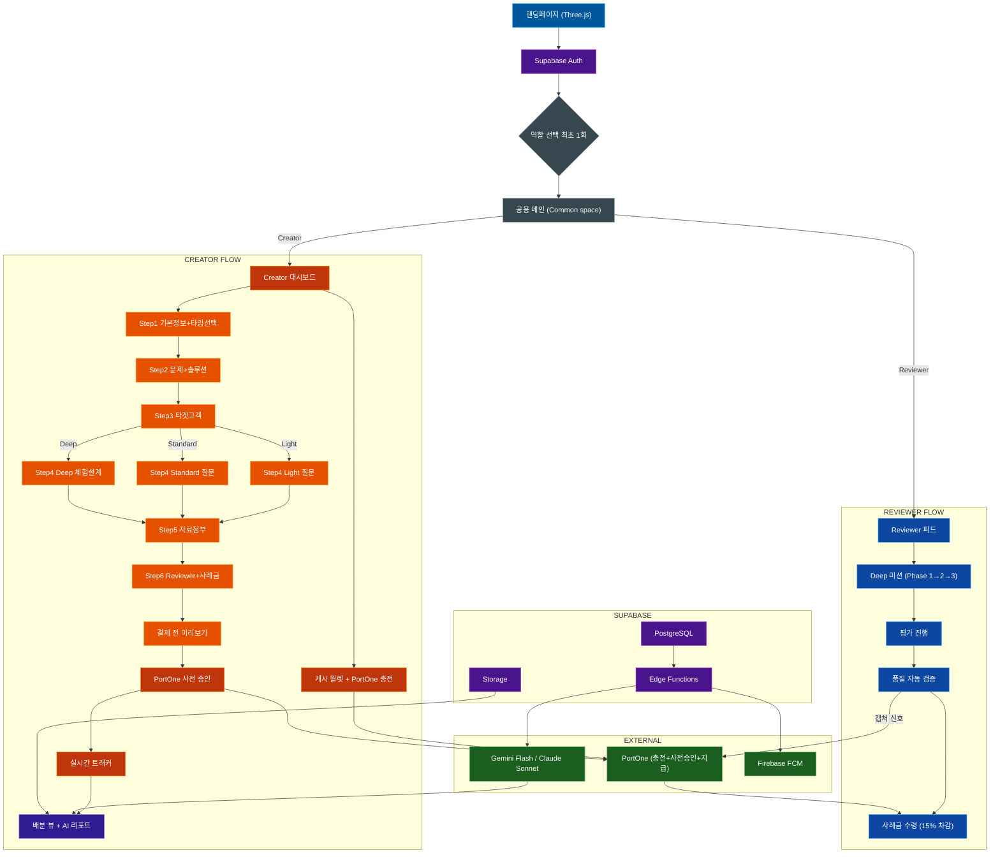

# FindFit — 완전한 서비스 기획서 & Claude Code 컨텍스트 v6.0

> **Claude Code 자동 로드 파일** — 이 파일을 읽었으면 코드 작성 전 반드시 전체 내용을 숙지하세요.
> 아키텍처, 네이밍 규칙, 비즈니스 로직, 결제 플로우를 모두 따르세요.

---

## 문서 구조

| # | 섹션 | 목적 |
|---|------|------|
| 0 | 서비스 정의 & 비전 | 방향성 |
| 1 | 수익 구조 | 과금 로직 기준 |
| 2 | 프로젝트 타입 설계 | Light / Standard / Deep |
| 3 | 결제 인프라 & 사전 승인 플로우 | PortOne 구현 기준 |
| 4 | 랜딩페이지 디자인 스펙 | Three.js 히어로 포함 UI 기준 |
| 5 | Startup Canvas & 제품 전략 | 사업 맥락 |
| 6 | VC 프레임워크 & 검증 방법론 | 플랫폼 핵심 철학 |
| 7 | 프로젝트 등록 위자드 — 필드 완전 설계 | 타입별 분기 · 미리보기 · 미션 플로우 |
| 8 | User Personas | 타겟 설계 기준 |
| 9 | 전체 아키텍처 & 기술 스택 | 코드 작성 기준 |
| 10 | 액션 플랜 | 실행 로드맵 |

---

## 0. 서비스 정의 & 비전

**FindFit** — Creator가 아이디어를 출시 전에 실제 사람들에게 검증받는 양면 PSF/PMF 검증 플랫폼.

- **Creator(의뢰자)**: 캐시로 플랫폼 이용료 납부 → 프로젝트 등록 → Reviewer 스마트 매칭 → AI 리포트 수신
- **Reviewer(평가자)**: 관심 도메인 매칭 푸시 수신 → 구조화된 리뷰 → 사례금 수령
- **수익 모델**: 캐시 충전 마진 + 사례금 수수료 15% (Reviewer 수령액에서 차감)

> **비전**: "만들기 전에, 팔릴지 먼저 확인하세요 — 모든 아이디어가 시장의 신호로 시작하는 세상"

---

## 1. 수익 구조

### 캐시 충전 패키지

| 충전액 | 지급 캐시 | 보너스 |
|--------|---------|--------|
| 10,000원 | 10,000C | 없음 (진입용) |
| 30,000원 | 33,000C | +10% |
| 50,000원 | 57,500C | +15% |
| 100,000원 | 120,000C | +20% |

- 미사용 캐시 **180일 후 자동 소멸** → FindFit 귀속
- 캐시는 플랫폼 이용료 전용 (사례금 용도 사용 불가 — 규제 이슈)

---

### 프로젝트 타입별 수익

| 타입 | 캐시 수익 (플랫폼 이용료) | 사례금 수수료 |
|------|------|------|
| **Light** | 4,900C 고정 | 없음 |
| **Standard** | 1,800C × Reviewer 수 | 사례금 × 15% (Reviewer 수령액에서 차감) |
| **Deep** | 1,800C × Reviewer 수 | 사례금 × 15% (Reviewer 수령액에서 차감) |

---

### 사례금 수수료 구조 (Standard / Deep)

Creator가 사례금을 걸면 FindFit이 15%를 Reviewer 수령액에서 차감한다.
Creator 결제 금액은 사례금 원금만 (수수료 추가 없음).

**예시 — 10명, 사례금 1인당 10,000원:**

```
Creator 결제 (사전 승인): 100,000원 (10명 × 10,000원)

리뷰 완료 후 PortOne 캡처 & 정산:
  Reviewer 1인 실 수령: 8,500원 (15% 차감)
  FindFit 수수료:       1,500원/명
  FindFit 총 수수료:    15,000원 (10명 기준)
```

---

### 수익 시뮬레이션

**Standard 10명 / 사례금 10,000원 기준:**

| 항목 | 금액 |
|------|------|
| 캐시 이용료 (1,800 × 10명, 스탠다드 기준 원가) | 약 13,000원 |
| 사례금 수수료 (15% × 100,000원) | 15,000원 |
| **건당 총수익** | **약 28,000원** |

**월 건수별 시뮬레이션 (고정비 380만원 기준):**

| 월 건수 | 월수익 | 고정비 차감 |
|--------|--------|-----------|
| 50건 | 약 140만원 | 🔴 -240만원 |
| 100건 | 약 280만원 | 🔴 -100만원 |
| **140건** | **약 392만원** | **🟢 손익분기** |
| 200건 | 약 560만원 | 🟢 +180만원 |

> Light 타입은 캐시 4,900C만 수익. 초기 유입·습관 형성 목적.

---

### AI 리포트 수익 (EXP 레벨 연동)

| Creator 레벨 | AI 엔진 | 리포트 가격 |
|-------------|--------|-----------|
| Seed | Gemini Flash | 유료 |
| Sprout | Gemini Flash | 유료 |
| Builder | Claude Sonnet | **무료** |
| Launcher | Claude Sonnet | **무료** |

레벨업할수록 더 좋은 엔진을 무료로 → 리텐션 + 재의뢰 유도 구조.

---

## 2. 프로젝트 타입 설계

### 타입 개요

| | **Light** | **Standard** | **Deep** |
|---|---|---|---|
| 질문 방식 | A/B 테스트 · 키워드 선택 · 예/아니오 | 설문형 (객관식·주관식·리커트) | 체험형 (앱·웹 직접 사용 후 평가) |
| 플랫폼 이용료 | **4,900C 고정** | **1,800C/명** | **1,800C/명** |
| 최소 Reviewer | 제한 없음 | **10명** | **10명** |
| 사례금 | **없음** | Creator 자율 설정 | Creator 자율 설정 |
| 참여 기간 | 등록일부터 **최대 5일** | 등록일부터 **최대 10일** | 등록일부터 **최대 10일** |
| AI 리포트 | **무료** | 레벨별 (Seed/Sprout 유료, Builder+ 무료) | 레벨별 |
| 결제 구조 | 캐시 차감만 | 캐시 + PortOne 사전 승인 | 캐시 + PortOne 사전 승인 |

---

### Light 타입 상세

빠른 방향성 확인용. 사례금 없이 캐시 4,900C만으로 운영.

**허용 질문 타입:**
- A/B 테스트: 이미지/텍스트/카드 2개 중 선택
- 키워드 선택: 제시된 키워드 중 해당하는 것 선택 (최대 10개 제시)
- 예/아니오: 단순 이진 선택

**Reviewer 참여 동기:** 포인트(EXP) 적립 + 신제품 선행 접근

**리포트:** 선택 분포 + 간단한 인사이트 (Gemini Flash, 무료)

---

### Standard 타입 상세

설문 기반 PSF/PMF 검증. 그 자리에서 즉시 완료.

- 질문 최대 10개 (Sean Ellis Test 자동 포함 — 제거 불가)
- 질문 타입: 객관식 / 주관식 / 리커트 5점
- PSST 프레임워크 기반 템플릿 제공
- 사례금: Creator 자율 설정, Reviewer 수령액에서 15% 차감 후 지급

---

### Deep 타입 상세

앱·게임·웹서비스 직접 체험 후 평가. 시간이 필요한 검증.

- 체험 링크 / 파일 첨부 (APK 등, 최대 100MB)
- 체험 가이드 필수 입력 (300자)
- 예상 체험 시간 설정: 5분 / 10분 / 15분 / 30분 / 1시간+
- 체험 완료 기한: 24시간 / 48시간 / 72시간 (전체 10일 이내)
- 스크린샷 첨부 요청 옵션
- 사례금 권장 기준: 5분→3,000원~ / 15분→8,000원~ / 30분→15,000원~ / 1시간+→25,000원~
- 사례금: Reviewer 수령액에서 15% 차감 후 지급

---

### 사례금 배분 방식 (Standard / Deep 공통)

Creator가 모든 리뷰 완료 후 피드백을 보고 배분 방식 선택.

| 방식 | 설명 |
|------|------|
| **균등** | 모든 Reviewer 동일 금액 |
| **차등** | Creator가 각자 금액 직접 입력 |
| **Top N** | 상위 N명에게만 지급 |
| **커스텀** | 자유 조합 |

**72시간 자동 처리:** 배분 미결정 시 균등 배분으로 자동 처리 → PortOne 자동 지급

**완료된 Reviewer 보호 원칙:** 어떤 경우에도 완료한 Reviewer 사례금은 반드시 지급.

---

## 3. 결제 인프라 & 사전 승인 플로우

### 결제 인프라 전환 계획

| 단계 | 인프라 | 이유 |
|------|--------|------|
| **베타** | **PortOne Free** | 초기 비용 없음, 개인 Reviewer 정산 가능 |
| **성장** | Toss Payments | 안정성, 한국 최적화 |

> PortOne FAQ 확인: "포트원은 여러 PG+간편결제까지 하나의 계좌로 통합해 개인·법인·프리랜서 모두에게 지급 가능"
> → Reviewer가 일반 개인이어도 사례금 지급 가능 (지급대행 기능)

---

### Light 결제 플로우

```
프로젝트 등록 클릭
 │
 ├── 캐시 잔액 확인
 │    충분 (4,900C 이상) → 차감 후 프로젝트 시작
 │    부족 → 캐시 충전 안내 → 충전 후 재시도
 │
 └── 추가 결제 없음 (사례금 없음)
```

---

### Standard / Deep 결제 플로우 (사전 승인 구조)

사전 승인(Pre-authorization)은 2단계로 동작한다.

**1단계 — 승인 (프로젝트 등록 시)**

```
Creator → PortOne → 카드사/은행
"이 카드에 N만원 사용 가능한지 확인 + 금액 잠금"

은행 처리:
 ✅ 한도/잔액 충분 → 금액 잠금 (돈은 아직 안 나감)
 ❌ 한도/잔액 부족 → 승인 거절 → 프로젝트 등록 차단
```

**2단계 — 캡처 (리뷰 완료 시)**

```
모든 Reviewer 리뷰 완료 (또는 72시간 자동 처리)
 │
 └── PortOne 캡처 (실제 청구)
      → Reviewer 1인당 사례금에서 15% 차감 후 지급
      → FindFit 수수료 수취
      → 이 시점이 실제 결제 완료
```

> **중요**: 사전 승인은 "잠금"이고, 캡처가 "실제 출금"이다.
> 카드 실패는 등록 시점(1단계)에서만 발생 → Reviewer가 일을 한 뒤 정산 실패하는 상황 원천 차단.
>
> **개발 전 PortOne 기술지원 필수 확인 사항:**
> - 한국 체크카드 사전 승인 시 알림 동작 방식
> - 부분 캡처(Partial Capture) 지원 여부 및 구현 방식

---

### 등록 시 결제 화면 구성

```
[Step 6 최종 화면]

캐시 차감   18,000C   ← 자동 처리 (별도 결제창 없음)
──────────────────────────────────
카드 사전 승인  100,000원
(10명 × 10,000원 / 리뷰 완료 후 실제 청구)
등록된 카드: **** 1234

        [프로젝트 시작하기]
```

버튼 1회: 캐시 차감 + PortOne 사전 승인 동시 처리.
PortOne 승인 실패 시 캐시 차감도 롤백.

---

### 부분 완료 시 처리 (미달 Reviewer)

등록 10명 중 7명만 완료된 경우:

```
사전 승인액: 100,000원 (10명치 잠금)

72시간 후 7명 완료:
 → PortOne 부분 캡처: 70,000원 (7명치만 실제 청구)
 → 나머지 30,000원: 잠금 자동 해제 (환불 아님, 처음부터 안 나간 것)
 → 캐시 환불: 3 × 1,800C = 5,400C 복구
```

**완료율 기준 처리 분기:**

| 완료율 | 처리 |
|--------|------|
| 100% | 전액 캡처 + 정산 |
| 70% 이상 | 부분 캡처 + 나머지 잠금 해제 + 캐시 복구 |
| 70% 미만 | Creator에게 선택지 제공 (연장 / 지금 받기 / 전액 취소) |
| 0% | 전액 취소 + 캐시 전액 복구 |

> 완료한 Reviewer 사례금은 어떤 경우에도 반드시 지급.

---

### Reviewer 사례금 표시 원칙

Reviewer가 미션 카드에서 확인하는 정보:

```
사례금 10,000원
(플랫폼 수수료 15% 차감 후 실 수령 8,500원)
```

수락 전 실수령액을 명확히 고지. 수락 = 조건 동의.

---

## 4. 랜딩페이지 디자인 스펙

> Claude Code는 이 섹션을 보고 랜딩페이지 (`app/(landing)/page.tsx`)를 구현한다.
> **Three.js 3D 애니메이션 히어로 + 오렌지 브랜드 컬러 + 양면 구성 (Creator + Reviewer)**

### 4-1. 브랜드 컬러 시스템

```css
--color-primary: #FF8C00;
--color-primary-dark: #E65100;
--color-primary-light: #FFB74D;
--color-accent: #FF6D00;
--color-bg-dark: #0A0A0A;
--color-bg-gradient-start: #1a0a00;
--color-bg-gradient-end: #0A0A0F;
--color-reviewer: #1565C0;
--color-reviewer-light: #42A5F5;
--glass-bg: rgba(255, 255, 255, 0.05);
--glass-border: rgba(255, 140, 0, 0.2);
--glass-blur: blur(12px);
--color-text-primary: #FFFFFF;
--color-text-secondary: rgba(255, 255, 255, 0.7);
--color-text-muted: rgba(255, 255, 255, 0.4);
```

### 4-2. 히어로 섹션 — Three.js 구현 스펙

```typescript
// components/landing/HeroCanvas.tsx
// Three.js r128

const sceneConfig = {
  mainObject: {
    geometry: 'IcosahedronGeometry', // radius: 1.8, detail: 1
    material: 'MeshPhongMaterial',
    color: '#FF8C00',
    emissive: '#E65100',
    shininess: 60,
  },
  wireLayer: {
    geometry: 'IcosahedronGeometry', // radius: 1.85, detail: 1
    material: 'MeshBasicMaterial',
    color: '#FFB74D',
    wireframe: true,
    opacity: 0.3,
  },
  particles: { count: 800, size: 0.015, color: '#FF8C00', opacity: 0.6 },
  lights: [
    { type: 'AmbientLight', color: '#1a0a00', intensity: 0.5 },
    { type: 'DirectionalLight', color: '#FF8C00', intensity: 1.2, position: [5,5,5] },
    { type: 'PointLight', color: '#FFB74D', intensity: 0.8, position: [-3,-3,-3] },
  ],
  animation: {
    rotation: { x: 0.003, y: 0.005 },
    float: { amplitude: 0.1, speed: 0.8 },
    mouseInteraction: true,
  },
};
```

### 4-3. 랜딩페이지 섹션 구조

**Section 1 — HERO (Three.js)**
헤드라인: "만들기 전에, 팔릴지 먼저 확인하세요."
CTA: [내 아이디어 검증받기 →] [Reviewer 참여하기]

**Section 2 — 공감 (Creator 대상)**
"혹시 이런 경험 있으신가요?"
카드 3개: 지인 칭찬 편향 / 만들었는데 아무도 안 씀 / 방향 확신 없음

**Section 3 — 단계 선택 인터랙션**
[아이디어] [프로토타입] [베타] [출시 후] 탭 선택 → 동적 텍스트 전환

**Section 4 — 작동 방식 3단계**
아이디어 올리기 → 전문가들이 솔직하게 봐줘요 → 결과 리포트 받기

**Section 5 — Reviewer 섹션 (블루 톤)**
"신제품을 남들보다 먼저 보고 싶다면?"

**Section 6 — 신뢰/수치**
**Section 7 — 최종 CTA**

### 4-4. 라우팅

```typescript
const routes = {
  landing: '/',                    // 비로그인만 (로그인 시 /main 리다이렉트)
  login: '/auth/login',
  signup: '/auth/signup',
  roleSelect: '/auth/role-select', // 최초 로그인 1회
  commonMain: '/main',             // 로그인 후 공용 공간 (Creator+Reviewer 동일)
  creatorDashboard: '/creator/dashboard',
  reviewerFeed: '/reviewer/feed',
  admin: '/admin',
};
```

### 4-5. 랜딩 언어 가이드

| 기획 용어 | 랜딩 언어 |
|---------|---------|
| PSF/PMF 검증 | 아이디어 반응 확인 / 팔릴지 확인 |
| Creator | 창업자 / 메이커 |
| Reviewer | 전문 리뷰어 |
| Sean Ellis Test | "이 서비스 없어지면 얼마나 아쉬울까요?" |
| AI 리포트 | 결과 리포트 |

---

## 5. Startup Canvas & 제품 전략

### 린 캔버스

| 섹션 | 내용 |
|------|------|
| **문제** | ① 지인 피드백 편향 ② 전문 리서치 비용 수백만원 ③ 검증 방법 모름 |
| **고객** | 솔로 빌더 / 초기 스타트업 창업자 / 전문 Reviewer |
| **고유 가치 제안** | "10일 이내, 저비용으로, 실제 사람의 데이터 기반 리포트" |
| **솔루션** | Light/Standard/Deep 타입별 검증 + AI 리포트 |
| **채널** | 스타트업 커뮤니티 → SEO → 레퍼럴 → 액셀러레이터 B2B |
| **수익원** | 캐시 충전 마진 + 사례금 수수료 15% + AI 리포트 (레벨별) |
| **핵심 지표** | 월간 완료 프로젝트 건수 / 첫 충전 전환율 |
| **경쟁 우위** | 누적 리뷰 데이터 + 업종별 벤치마크 스코어 |

### 트레이드오프 — 하지 않을 것

- ❌ 월간 구독 모델
- ❌ 대기업 전용 서비스
- ❌ 1만명 이상 대규모 설문
- ❌ Reviewer 경쟁 방식 (1명만 선택)

---

## 6. VC 프레임워크 & 검증 방법론

### 6-1. PSST Law

| 항목 | 의미 | FindFit 적용 |
|------|------|------------|
| **P — Problem** | 실재하고 고통스러운 문제인가? | 질문 1~3번: 문제 인식·빈도·강도 |
| **S — Solution** | 문제를 실제로 해결하는가? | 질문 4~6번: 솔루션 유용성·차별성 |
| **S — Scale** | 시장 규모가 충분한가? | AI 리포트: 벤치마크 + 세그먼트 추정 |
| **T — Team** | 이 팀이 해결할 수 있는가? | Creator 프로필 (선택) |

### 6-2. Sean Ellis Test (Standard / Deep 필수 포함)

> "이 제품/서비스를 더 이상 사용할 수 없게 된다면 어떤 기분이 들겠습니까?"
> 1. 매우 실망할 것이다 😢
> 2. 약간 실망할 것이다
> 3. 실망하지 않을 것이다
> 4. 이 제품을 사용하지 않는다

| 결과 | 해석 |
|------|------|
| "매우 실망" ≥ 40% | PMF 달성 신호 🟢 |
| 25~39% | PMF 접근 중 🟡 |
| < 25% | 피봇 또는 재설계 권고 🔴 |

### 6-3. EXP 레벨 시스템

**Creator 레벨:**

| 레벨 | 명칭 | 혜택 |
|------|------|------|
| 1 | Seed | 기본 기능, AI 리포트 유료 (Gemini) |
| 2 | Sprout | AI 리포트 유료 (Gemini) |
| 3 | Builder | AI 리포트 무료 (Claude Sonnet) |
| 4 | Launcher | AI 리포트 무료 (Claude Sonnet) + 프리미엄 |

**Reviewer 레벨:**

| 레벨 | 명칭 |
|------|------|
| 1 | Piece |
| 2 | Connector |
| 3 | Fitter |
| 4 | Master Fit |

### 6-4. ICE Score — MVP 기능 우선순위

| 기능 | Impact | Confidence | Ease | ICE |
|------|--------|-----------|------|-----|
| Sean Ellis 필수 질문 | 9 | 10 | 8 | 9.0 |
| 캐시 월렛 + 결제 | 10 | 9 | 7 | 8.7 |
| 3타입 위자드 | 9 | 9 | 7 | 8.3 |
| 스마트 푸시 매칭 | 10 | 8 | 6 | 8.0 |
| AI 리포트 자동 생성 | 10 | 8 | 5 | 7.7 |
| 실시간 트래커 | 7 | 9 | 7 | 7.7 |

---

## 7. 프로젝트 등록 위자드 — 필드 완전 설계

> 총 6단계 / 5분 이내 완료 목표
> **Step 1에서 타입 선택 → Step 4가 타입별로 완전히 분기**

### 타입 선택 (Step 1에서 결정)

```
[Light]              [Standard]           [Deep]
"빠른 반응 확인"       "설문으로 검증"        "써보고 평가"
4,900C 고정           1,800C/명             1,800C/명
사례금 없음            사례금 자율            사례금 자율
최대 5일              최대 10일              최대 10일
```

---

### Step 1 — 기본 정보 + 타입 선택

| 항목 | 타입 | 제한 | 가이드 |
|------|------|------|--------|
| 제품/서비스 이름 | 텍스트 | 최대 30자 | 엘리베이터 피치 압축 |
| 한 줄 소개 | 텍스트 | 최대 60자 | Reviewer 카드에 그대로 노출 |
| 카테고리 | 멀티태그 | 최대 3개 | 앱/게임/웹/SaaS/커머스/헬스/에듀/핀테크/푸드/부동산/기타 |
| 현재 단계 | 라디오 | 필수 | 아이디어/프로토타입/베타/출시 후 |
| **프로젝트 타입** ⭐ | 라디오 | 필수 | Light / Standard / Deep |
| 랜딩·소개 URL | URL | 선택 | Reviewer 참고용 |

---

### Step 2 — 문제와 솔루션 (공통)

| 항목 | 제한 | 가이드 |
|------|------|--------|
| 어떤 문제를 해결하나요? | 200자 | 타겟이 겪는 구체적 불편 상황 |
| 기존 대안과 한계 | 150자 | 지금 사람들이 어떻게 해결하는지 + 단점 |
| 우리 솔루션이 다른 점 | 150자 | 구체적으로, "더 빠르다"보다 명확하게 |

---

### Step 3 — 타겟 고객 (공통)

| 항목 | 타입 | 가이드 |
|------|------|--------|
| 연령대 | 멀티체크 | 10대~60대+ |
| 직군 | 멀티체크 | 직장인/학생/프리랜서/창업자/주부/기타 |
| 관심사 키워드 | 태그 | 최대 5개 (매칭 알고리즘 활용) |
| 타겟 상황·맥락 | 텍스트 100자 | 어떤 순간에 이 제품이 필요한지 |
| 구매·사용 결정 요인 | 라디오 | 가격/편의성/신뢰성/기능/디자인/기타 |

---

### Step 4 — 검증 내용 ⭐ [타입별 완전 분기]

**[Light 전용]**

| 항목 | 설명 |
|------|------|
| A/B 테스트 | 이미지·텍스트·카드 2개 제시, 1개 선택 |
| 키워드 선택 | 키워드 최대 10개 제시, 해당하는 것 선택 |
| 예/아니오 | 단순 이진 선택 질문 |
| 질문 수 | 최대 5개 (Sean Ellis 제외, Light는 Sean Ellis 미포함) |

**[Standard 전용]**

| 항목 | 설명 |
|------|------|
| 이번 검증 목표 | 100자, 어떤 의사결정을 위한 검증인지 |
| 검증 가설 | 템플릿: "우리는 [타겟]이 [솔루션] 때문에 [결과]를 원한다고 가정한다" |
| 질문 추가 | 최대 10개 (Sean Ellis 자동 포함 → 실제 작성 가능 9개) |
| 질문 타입 | 객관식/주관식/리커트 5점 |
| **Sean Ellis Test** | 🔒 자동 포함, 삭제 불가 |

**[Deep 전용]**

| 항목 | 타입 | 필수 | 가이드 |
|------|------|------|--------|
| 체험 링크 | URL | 필수 | 앱스토어/TestFlight/웹 URL |
| 체험 파일 | 파일 | 선택 | APK 등 최대 100MB |
| 체험 가이드 | 텍스트 300자 | 필수 | 핵심 사용 경로 안내 |
| 예상 체험 시간 | 슬라이더 | 필수 | 5/10/15/30분/1시간+ |
| 체험 완료 기한 | 라디오 | 필수 | 24/48/72시간 |
| 스크린샷 요청 | 토글 | 선택 | ON 시 캡처 1장 이상 첨부 요청 |
| 체험 후 질문 | 질문 작성기 | 최대 10개 | |
| **Sean Ellis Test** | 🔒 고정 | 자동 포함 | |

---

### Step 5 — 자료 첨부 (공통)

| 항목 | 제한 |
|------|------|
| 이미지·목업 | 최대 10장 (JPG·PNG·GIF) |
| 소개 영상 URL | YouTube/Vimeo, 선택 |
| 추가 문서 | PDF 최대 2개, 선택 |
| 노출 설정 | 각 자료별 공개 여부 토글 |

> 의뢰인 실명·회사명은 항상 블라인드 처리 (변경 불가)

---

### Step 6 — Reviewer 선택 · 사례금 · 비용 확인

**Light:**

```
캐시 차감: 4,900C
사례금: 없음

[프로젝트 시작하기]
```

**Standard / Deep:**

| 항목 | 타입 | 설명 |
|------|------|------|
| Reviewer 수 | 선택 | 10 / 20 / 30 / 50 / 100명 (최소 10명) |
| 1인당 사례금 | 숫자 입력 | Creator 자율 설정. Deep은 시간 기반 권장액 표시 |
| AI 리포트 | 라디오 | 레벨별 자동 적용 (Seed/Sprout 유료, Builder+ 무료) |
| 배분 방식 | 라디오 | 나중에 결정 / 균등 / 차등 / Top N / 커스텀 |

**비용 요약:**

```
캐시 차감    : 1,800C × N명
잔여 캐시    : [현재 잔액 - 캐시 소모] C
────────────────────────────────────
사전 승인액  : [1인당 사례금 × N명] 원
(리뷰 완료 후 실제 청구 / 수수료는 Reviewer에서 차감)

[다음: 미리보기]
```

---

### 결제 전 미리보기 (탭 전환)

**[내 요약] 탭:**

```
제품명: OOO         타입: Standard
평가단: 10명         기간: 최대 10일
캐시 차감: 18,000C   잔여: 82,000C

── 질문 목록 ──────────────────
1. [리커트] 불편함 심각도
2. [주관식] 가장 마음에 드는 점
3. [고정] Sean Ellis Test 🔒

── 비용 명세 ───────────────────
사전 승인: 100,000원
(리뷰 완료 후 실제 청구, 미완료분 자동 해제)
```

**[Reviewer에게 보이는 모습] 탭:**

```
[앱] [헬스] · 프로토타입

"운동 기록을 자동으로 분석해주는 앱"

소요시간: 10~15분
사례금: 10,000원 → 실 수령 8,500원 (수수료 15% 차감)
마감: 10일 후

의뢰인: 비공개
```

---

### 블라인드 정책

| 항목 | Creator | Reviewer |
|------|---------|----------|
| 의뢰인 실명·회사 | ✅ | ❌ |
| 기대 결과·가설 | ✅ | ❌ |
| 카테고리·단계 | ✅ | ✅ |
| 제품 설명·자료 | ✅ | ✅ |
| 체험 링크 | ✅ | ✅ (수락 후만) |
| 다른 Reviewer 답변 | ✅ (리포트 집계) | ❌ |

---

### Deep 타입 미션 플로우 (Reviewer 경험)

```
Phase 1 — 수락
 미션 카드 노출 (예상 시간·사례금·실수령액 표시)
 [수락] → 체험 링크 즉시 전달 → 기한 명시 → FCM 동의

Phase 2 — 체험 기간
 기한 -24h: "체험 완료하고 사례금 받아가세요!" 푸시
 기한 -6h:  "마감 얼마 안 남았어요 ⏰" 푸시
 [체험 완료했어요] 선택 버튼 (심리적 커밋)

Phase 3 — 평가 제출
 [평가 작성하기] → 스크린샷 첨부(요청 시) → 질문 답변 → 제출
 제출 즉시: "사례금 지급 처리 중" 알림
 품질 검증 통과 → PortOne 캡처 → 실수령액 지급

미완료 시:
 기한 경과 → 미션 취소 → Creator 알림 → 대체 Reviewer 자동 매칭
 미제출분 사전 승인 잠금 자동 해제
```

---

## 8. User Personas

### Creator 페르소나 1 — "검증이 두려운 솔로 빌더" 김지훈 (29세)
- 前 IT 기획자, 노코드로 사이드프로젝트 운영
- JTBD: "3개월 혼자 만든 아이디어를 낯선 사람에게 확인받고 싶다"
- 시사점: Light 타입으로 부담 없이 시작 → Standard/Deep으로 업셀

### Creator 페르소나 2 — "투자자 설득이 급한 초기 창업자" 박소연 (34세)
- B2B SaaS 공동창업자, 6개월 내 시드 목표
- JTBD: "IR 덱에 넣을 정량 PMF 증거가 필요하다"
- 시사점: Standard + AI 리포트 PDF 내보내기

### Reviewer 페르소나 — "의미 있는 부업을 원하는 도메인 전문가" 이민준 (38세)
- B2B SaaS PM 7년차
- JTBD: "PM 경험으로 부수입 + 신제품 선행 접근"
- 시사점: "당신의 피드백으로 빌더가 피봇했습니다" 알림이 핵심 동기

---

## 9. 전체 아키텍처 & 기술 스택

### 기술 스택

| 영역 | 기술 | 비고 |
|------|------|------|
| 웹 프론트엔드 | Next.js 14 (App Router) | Vercel |
| 3D 히어로 | Three.js r128 | 랜딩페이지 전용 |
| 앱 변환 | Capacitor.js | iOS/Android |
| 백엔드 | Supabase | Auth + PostgreSQL + Storage + Realtime |
| AI 리포트 (베타) | Gemini Flash (gemini-2.0-flash-exp) | 무료 쿼터 활용 |
| AI 리포트 (성장) | Claude Sonnet (claude-sonnet-4-6) | Builder+ 레벨 무료 제공 |
| AI 추상화 | `lib/ai/index.ts` | AI_ENGINE 환경변수로 전환 |
| 결제 (캐시) | PortOne → Toss (성장 후) | 캐시 충전 |
| 결제 (사례금) | PortOne 사전 승인 + 지급대행 | 개인 Reviewer 정산 가능 |
| 푸시 알림 | Firebase FCM | 앱 전용 |
| 리워드 | Giftishow API | 기프티콘 자동 발송 |
| 스타일 | Tailwind CSS | Glassmorphism UI |

### AI 추상화 레이어

```typescript
// lib/ai/index.ts
const AI_ENGINE = process.env.AI_ENGINE // "gemini" | "claude"

export async function generateReport(reviews, projectInfo) {
  if (AI_ENGINE === "claude") return callClaude(reviews, projectInfo)
  return callGemini(reviews, projectInfo)  // default
}
```

```typescript
// lib/ai/gemini.ts — 베타 엔진
import { GoogleGenerativeAI } from "@google/generative-ai"

// lib/ai/claude.ts — 성장 엔진
import Anthropic from "@anthropic-ai/sdk"
// model: "claude-sonnet-4-6"
```

### 전체 서비스 아키텍처 (Mermaid)



### 디렉토리 구조

```
findfit/
├── app/
│   ├── (landing)/page.tsx
│   ├── auth/
│   │   ├── login/page.tsx
│   │   ├── signup/page.tsx
│   │   └── role-select/page.tsx
│   ├── main/page.tsx                         # 공용 메인
│   ├── (creator)/
│   │   ├── dashboard/page.tsx
│   │   ├── wallet/page.tsx
│   │   ├── projects/
│   │   │   ├── new/
│   │   │   │   ├── page.tsx                  # 위자드 컨테이너
│   │   │   │   ├── preview/page.tsx          # 결제 전 미리보기
│   │   │   │   └── steps/
│   │   │   │       ├── Step1BasicInfo.tsx    # 기본정보 + 타입 선택
│   │   │   │       ├── Step2Problem.tsx
│   │   │   │       ├── Step3Target.tsx
│   │   │   │       ├── Step4Light.tsx        # Light 질문 설계
│   │   │   │       ├── Step4Standard.tsx     # Standard 설문 설계
│   │   │   │       ├── Step4Deep.tsx         # Deep 체험 설계
│   │   │   │       ├── Step5Attachments.tsx
│   │   │   │       └── Step6Payment.tsx      # Reviewer + 사례금 + 비용
│   │   │   └── [id]/
│   │   │       ├── page.tsx
│   │   │       ├── distribution/page.tsx     # 배분 뷰
│   │   │       └── report/page.tsx           # AI 리포트
│   ├── (reviewer)/
│   │   ├── feed/page.tsx
│   │   ├── mission/[matchId]/page.tsx        # Deep 미션 Phase 1~3
│   │   └── review/[matchId]/page.tsx
│   └── api/
│       ├── projects/route.ts
│       ├── projects/[id]/distribute/route.ts
│       ├── ai-report/[projectId]/route.ts
│       ├── portone/
│       │   ├── webhook/route.ts
│       │   └── transfer/route.ts             # Reviewer 사례금 지급
│       └── users/reviewer/register/route.ts
├── components/
│   ├── landing/
│   │   ├── HeroCanvas.tsx
│   │   ├── StageSelector.tsx
│   │   └── ...
│   ├── creator/
│   ├── reviewer/
│   │   ├── MissionCard.tsx
│   │   └── MissionProgress.tsx
│   └── shared/
├── lib/
│   ├── supabase/client.ts
│   ├── supabase/server.ts
│   ├── ai/
│   │   ├── index.ts                          # 추상화 레이어
│   │   ├── gemini.ts
│   │   └── claude.ts
│   ├── payments/
│   │   ├── portone.ts                        # 캐시 충전 + 사전 승인
│   │   └── transfer.ts                       # Reviewer 지급대행
│   └── wizard/questions.ts
├── supabase/
│   └── functions/
│       ├── generate-ai-report/
│       ├── auto-distribute/                  # 72시간 자동 처리
│       ├── quality-screening/
│       └── exp-calculator/
└── claude_findfit.md
```

### 데이터베이스 스키마

```sql
-- 사용자
CREATE TABLE users (
  id UUID PRIMARY KEY DEFAULT gen_random_uuid(),
  email TEXT UNIQUE NOT NULL,
  role TEXT CHECK (role IN ('creator','reviewer')),
  name TEXT, phone TEXT, avatar_url TEXT,
  created_at TIMESTAMPTZ DEFAULT NOW()
);

-- Creator 프로필
CREATE TABLE creator_profiles (
  id UUID PRIMARY KEY DEFAULT gen_random_uuid(),
  user_id UUID REFERENCES users(id) ON DELETE CASCADE,
  exp_points INT DEFAULT 0,
  level TEXT DEFAULT 'seed',  -- seed|sprout|builder|launcher
  credit_balance INT DEFAULT 0,
  credit_expires_at TIMESTAMPTZ,
  total_projects INT DEFAULT 0,
  updated_at TIMESTAMPTZ DEFAULT NOW()
);

-- Reviewer 프로필
CREATE TABLE reviewer_profiles (
  id UUID PRIMARY KEY DEFAULT gen_random_uuid(),
  user_id UUID REFERENCES users(id) ON DELETE CASCADE,
  exp_points INT DEFAULT 0,
  level TEXT DEFAULT 'piece',  -- piece|connector|fitter|master_fit
  domain_tags TEXT[],
  career_years INT,
  job_title TEXT,
  portone_partner_id TEXT,
  bank_name TEXT,
  account_number TEXT,        -- 암호화 저장
  account_holder TEXT,
  is_account_verified BOOLEAN DEFAULT FALSE,
  is_nda_agreed BOOLEAN DEFAULT FALSE
);

-- 프로젝트
CREATE TABLE projects (
  id UUID PRIMARY KEY DEFAULT gen_random_uuid(),
  creator_id UUID REFERENCES users(id),
  title TEXT NOT NULL,
  category TEXT,
  stage TEXT,                 -- idea|prototype|beta|launched
  project_type TEXT,          -- light|standard|deep
  problem TEXT,
  solution TEXT,
  resource_url TEXT,
  target_count INT,           -- Light: NULL, Standard/Deep: 최소 10
  completed_count INT DEFAULT 0,
  status TEXT DEFAULT 'draft', -- draft|active|reviewing|completed|cancelled
  honorarium_per_person INT DEFAULT 0,  -- Light: 0
  distribution_method TEXT,   -- equal|differential|top_n|custom|NULL(미결정)
  portone_payment_key TEXT,   -- 사전 승인 키
  preauth_amount INT,         -- 사전 승인 총액
  distribution_deadline TIMESTAMPTZ,
  deadline_days INT,          -- Light: 5, Standard/Deep: 10
  -- Deep 전용
  experience_url TEXT,
  experience_guide TEXT,
  experience_duration_minutes INT,
  experience_deadline_hours INT,
  require_screenshot BOOLEAN DEFAULT FALSE,
  created_at TIMESTAMPTZ DEFAULT NOW(),
  completed_at TIMESTAMPTZ
);

-- 질문
CREATE TABLE review_questions (
  id UUID PRIMARY KEY DEFAULT gen_random_uuid(),
  project_id UUID REFERENCES projects(id) ON DELETE CASCADE,
  question_text TEXT NOT NULL,
  question_type TEXT,  -- ab_test|keyword|yes_no|multiple_choice|short_answer|sean_ellis|likert
  options JSONB,
  order_index INT,
  is_required BOOLEAN DEFAULT TRUE
);

-- 매칭
CREATE TABLE project_matches (
  id UUID PRIMARY KEY DEFAULT gen_random_uuid(),
  project_id UUID REFERENCES projects(id),
  reviewer_id UUID REFERENCES users(id),
  nickname TEXT NOT NULL,     -- Reviewer_A, Reviewer_B...
  status TEXT DEFAULT 'invited',  -- invited|accepted|experiencing|completed|dropped
  invited_at TIMESTAMPTZ DEFAULT NOW(),
  accepted_at TIMESTAMPTZ,
  completed_at TIMESTAMPTZ
);

-- 리뷰
CREATE TABLE reviews (
  id UUID PRIMARY KEY DEFAULT gen_random_uuid(),
  match_id UUID REFERENCES project_matches(id),
  project_id UUID REFERENCES projects(id),
  reviewer_id UUID REFERENCES users(id),
  answers JSONB NOT NULL,
  sean_ellis_ans TEXT,
  screenshot_urls TEXT[],
  quality_score FLOAT,
  is_passed BOOLEAN,
  submitted_at TIMESTAMPTZ DEFAULT NOW()
);

-- 배분 (사례금 정산)
CREATE TABLE distributions (
  id UUID PRIMARY KEY DEFAULT gen_random_uuid(),
  project_id UUID REFERENCES projects(id),
  reviewer_id UUID REFERENCES users(id),
  nickname TEXT,
  gross_amount INT NOT NULL,        -- Creator가 설정한 원금
  commission_amount INT NOT NULL,   -- 15% 수수료 (FindFit 수익)
  net_amount INT NOT NULL,          -- Reviewer 실수령액 (gross - commission)
  status TEXT DEFAULT 'pending',    -- pending|processing|completed|failed
  portone_transfer_id TEXT,
  paid_at TIMESTAMPTZ,
  created_at TIMESTAMPTZ DEFAULT NOW()
);

-- AI 리포트
CREATE TABLE ai_reports (
  id UUID PRIMARY KEY DEFAULT gen_random_uuid(),
  project_id UUID REFERENCES projects(id) UNIQUE,
  psf_score FLOAT,
  sean_ellis_pct FLOAT,
  recommendation TEXT,        -- continue|pivot|stop
  key_insights JSONB,
  pattern_analysis TEXT,
  benchmark_comment TEXT,
  action_plan JSONB,
  pivot_scenarios JSONB,
  pdf_url TEXT,
  is_unlocked BOOLEAN DEFAULT FALSE,
  ai_engine_used TEXT,        -- "gemini" | "claude"
  created_at TIMESTAMPTZ DEFAULT NOW()
);

-- 캐시 거래
CREATE TABLE credit_transactions (
  id UUID PRIMARY KEY DEFAULT gen_random_uuid(),
  creator_id UUID REFERENCES users(id),
  type TEXT,                  -- earn|use|expire|refund
  amount INT NOT NULL,
  source TEXT,
  project_id UUID REFERENCES projects(id),
  expires_at TIMESTAMPTZ,
  created_at TIMESTAMPTZ DEFAULT NOW()
);
```

### 핵심 비즈니스 규칙

**캐시 시스템**
- 캐시 = 플랫폼 이용료 전용. 사례금 용도 사용 불가 (규제)
- Light: 프로젝트당 4,900C 차감
- Standard/Deep: 1,800C × Reviewer 수 차감
- 미사용 캐시 **180일 후 자동 소멸**
- 미완료 Reviewer분 캐시 자동 복구 (부분 환불)

**사전 승인 & 사례금**
- 사전 승인 실패 → 프로젝트 등록 차단 (Reviewer 보호)
- 캡처 = 실제 청구 시점 (리뷰 완료 후)
- 부분 캡처: 완료 Reviewer 수만큼만 실제 청구, 나머지 잠금 자동 해제
- 수수료 15%는 Reviewer 수령액에서 차감 (Creator 결제액 불변)
- **PortOne 기술지원 필수 확인: 체크카드 사전 승인 동작, 부분 캡처 지원 여부**

**Sean Ellis 기준**
- Standard / Deep 모든 세션에 자동 포함, 삭제 불가
- "매우 실망" ≥ 40% → PMF 달성 신호

**AI 리포트**
- 환경변수 AI_ENGINE으로 엔진 전환 ("gemini" | "claude")
- Seed/Sprout → Gemini Flash / Builder+ → Claude Sonnet 자동 적용
- Sean Ellis 스코어를 리포트 최상단 첫 지표로 표시

**블라인드 평가**
- `reviews` 조회 시 `creator_id`, `company_name` JOIN 금지
- Row Level Security DB 레벨 강제

**품질 필터 (자동 반려)**
- 주관식 20자 미만
- 전체 응답 3분 미만
- 모든 리커트 동일값

**완료율 분기 처리**
- 70% 이상: 부분 캡처 + 자동 정산
- 70% 미만: Creator에게 연장/지금받기/전액취소 선택지 제공
- 완료한 Reviewer 사례금은 어떤 경우에도 반드시 지급

### 환경 변수

```bash
# Supabase
NEXT_PUBLIC_SUPABASE_URL=
NEXT_PUBLIC_SUPABASE_ANON_KEY=
SUPABASE_SERVICE_ROLE_KEY=

# AI (환경변수로 엔진 전환)
AI_ENGINE=gemini               # "gemini" | "claude"
GEMINI_API_KEY=
ANTHROPIC_API_KEY=

# 결제 (PortOne)
NEXT_PUBLIC_PORTONE_STORE_ID=
NEXT_PUBLIC_PORTONE_CHANNEL_KEY=
PORTONE_API_SECRET=

# 푸시
FIREBASE_SERVER_KEY=
NEXT_PUBLIC_FIREBASE_CONFIG=

# 리워드
GIFTISHOW_API_KEY=
```

### 코드 작성 규칙

1. **TypeScript 필수** — 모든 컴포넌트·함수에 타입 명시
2. **역할 구분** — `creator` / `reviewer` (builder·evaluator 사용 금지)
3. **Supabase 클라이언트** — 서버: `lib/supabase/server.ts` / 클라이언트: `lib/supabase/client.ts`
4. **캐시 잔액 검증** — 서버 사이드 전용 (클라이언트 신뢰 금지)
5. **AI 호출** — `lib/ai/index.ts` 추상화 레이어만 사용 (직접 호출 금지)
6. **사전 승인** — `lib/payments/portone.ts`에서만 처리
7. **지급대행** — `lib/payments/transfer.ts`에서만 처리
8. **사례금 수수료** — distributions 테이블에 gross/commission/net 분리 저장
9. **블라인드** — reviews 조회 시 creator 정보 JOIN 금지
10. **Sean Ellis** — 리포트 최상단 첫 지표로 표시 (Standard/Deep)
11. **Three.js** — `components/landing/HeroCanvas.tsx`에만 사용
12. **프로젝트 타입 분기** — Step4Light/Step4Standard/Step4Deep 컴포넌트 완전 분리, 공통 로직은 `lib/wizard/questions.ts`
13. **미션 상태 전환** — `project_matches.status` 변경은 서버 사이드 전용

### FigJam 다이어그램

- **통합 아키텍처**: https://www.figma.com/board/7WKsoeJB1hRb5yKWXg8rFx

---

## 10. 액션 플랜

### 즉시 (Week 1~2)
- LP 제작 + Three.js 히어로 배포
- **PortOne 기술지원 문의: 체크카드 사전 승인 동작, 부분 캡처 지원 여부 확인**
- Reviewer 1차 모집 목표 50명+
- Light 타입 컨시어지 MVP 5건 수동 진행

### 단기 (Week 3~6)
- 캐시 월렛 + Light 위자드 노코드 프로토타입
- Standard 위자드 + PortOne 사전 승인 플로우 프로토타입
- AI 리포트 파이프라인 (Gemini Flash) 프로토타입
- EXP 레벨 시스템 설계

### 중기 (Week 7~12)
- Deep 타입 미션 플로우 구현
- 사례금 자율 배분 UI + PortOne 지급대행 구현
- SNS 공유 카드 기능
- 액셀러레이터 파트너십 미팅

---

## 전략 선순환 구조

```
Light 타입 (4,900C, 진입 허들 낮음)
    ↓
Creator 습관 형성 + EXP 적립
    ↓
Standard/Deep으로 자연스러운 업셀
    ↓
Reviewer 사례금 수령 → 재참여 → 공급 풀 확대
    ↓
AI 리포트 품질 + 데이터 축적
    ↓
데이터 해자 형성 → 경쟁 우위
```

---

*FindFit claude_findfit.md v6.0 — 2026-05-31*
*역할명 Creator/Reviewer / PortOne 결제 인프라 / 사전 승인 구조 / Light·Standard·Deep 3타입 / 캐시 패키지 재설계 / 사례금 수수료 Reviewer 차감 방식 / AI 엔진 추상화 (Gemini→Claude) / EXP 레벨 시스템 / DB 전면 재설계*
